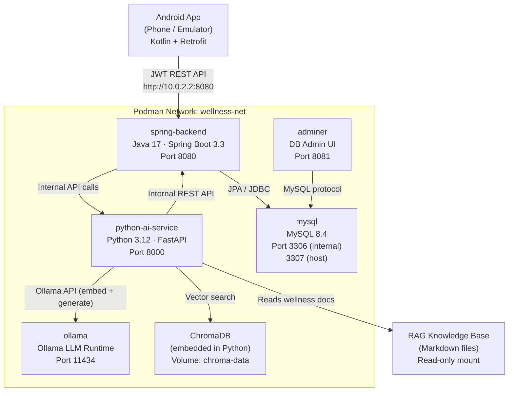

# Running the Wellness App on Podman

A complete, beginner-friendly guide to containerising and running this project using Podman.

---

## Table of Contents

1. [Introduction — What Is Podman?](#1-introduction--what-is-podman)
2. [Project Architecture](#2-project-architecture)
3. [Prerequisites](#3-prerequisites)
4. [Step 1 — Prepare Your Environment](#step-1--prepare-your-environment)
5. [Step 2 — Start MySQL and Ollama First](#step-2--start-mysql-and-ollama-first)
6. [Step 3 — Pull the AI Models into Ollama](#step-3--pull-the-ai-models-into-ollama)
7. [Step 4 — Build and Start Everything](#step-4--build-and-start-everything)
8. [Step 5 — Verify Everything Is Running](#step-5--verify-everything-is-running)
9. [Step 6 — Stop the Application](#step-6--stop-the-application)
10. [Step 7 — Restart the Application](#step-7--restart-the-application)
11. [Step 8 — Update After Code Changes](#step-8--update-after-code-changes)
12. [Step 9 — Troubleshooting](#step-9--troubleshooting)
13. [DevSecOps Notes](#devsecops-notes)

---

## 1. Introduction — What Is Podman?

### What Is a Container?

Imagine you have a fully set-up laptop that contains exactly the right version of Java, Python, MySQL, and every other dependency your project needs. Now imagine you can copy that entire laptop — as a single file — and give it to anyone on your team. They run that file and instantly have an identical environment.

That is what a **container** is. It is an isolated, self-contained unit that packages your application together with everything it needs to run: the operating system libraries, runtime (Java, Python), configuration files, and application code. A container runs identically on your Mac laptop, your teammate's Windows PC, and a cloud server in Singapore.

A container is **not** a virtual machine. A VM emulates an entire hardware computer, including its own operating system kernel. A container shares the host machine's kernel but isolates everything above it. This makes containers much smaller (megabytes, not gigabytes) and much faster to start (milliseconds, not minutes).

### What Is Podman?

**Podman** (Pod Manager) is an open-source, daemonless container engine developed by Red Hat. It is a drop-in replacement for Docker that offers stronger security by default.

Key components:

- **Podman CLI** — the `podman` command you type in your terminal. Its syntax is nearly identical to the `docker` command.
- **Podman Compose** — integrates with the Docker Compose CLI plugin so you can manage multi-container applications using the same `docker-compose.yml` files. You run it as `podman compose`.
- **Podman Machine** — on macOS, Podman runs containers inside a lightweight Linux virtual machine (VM). `podman machine` manages that VM.
- **Buildah** — the tool Podman uses under the hood to build container images from `Dockerfile`s.

### How Podman Differs from Docker

| Feature | Docker | Podman |
|---|---|---|
| Daemon | Requires a root-level background daemon (`dockerd`) | **Daemonless** — each container is a direct child process of your shell |
| Root requirement | Daemon runs as root on the host | **Rootless by default** — containers run as your user account |
| Compose | `docker compose` | `podman compose` (delegates to the same Docker Compose plugin) |
| Image format | OCI-compatible | OCI-compatible — the same images work with both |
| macOS runtime | Docker Desktop VM | Podman Machine (a QEMU-based Linux VM) |

Because Podman is daemonless and rootless, there is no long-running root process on your Mac. This is a meaningful security improvement.

### What Is a Container Image?

A **container image** is a read-only blueprint for a container. Think of it like a class in object-oriented programming:

- The **image** is the class (the blueprint).
- The **container** is the instance (the running object created from that blueprint).

An image is built from a `Dockerfile`, which is a text file containing step-by-step instructions for assembling the image.

```
Dockerfile  →  podman build  →  Image  →  podman run  →  Container
```

### Why Is Podman Useful for This Project?

Without Podman:

- Each team member installs Java 17, Python 3.12, MySQL 8.4, and Ollama separately.
- Everyone configures them differently, leading to "it works on my machine" bugs.
- The professor's computer may have different software versions and the demo breaks.

With Podman:

- Every service runs inside its own container with the exact right versions.
- One command starts everything.
- The demo environment is identical to the development environment.

### What Runs in Podman for This Project?

| Service | What It Does | In Podman? |
|---|---|---|
| MySQL 8.4 | Stores user accounts, wellness records, chat history | Yes |
| Spring Boot (Java 17) | REST API — authentication, records, AI proxy | Yes |
| Python FastAPI (Python 3.12) | RAG chatbot and AI recommendations | Yes |
| Ollama | Runs the local LLM (llama3.2:3b) | Yes |
| Adminer | Web UI to browse MySQL data | Yes |
| Android App | Mobile UI on your phone/emulator | **No** — runs natively in Android Studio |

The Android app is **not** containerised because it needs to run on Android hardware or an emulator. However, it talks to the Spring Boot API which does run in Podman.

---

## 2. Project Architecture

This diagram shows how each component communicates with the others.



**Key networking rule:** Services inside the `wellness-net` Podman network reach each other by **service name**. For example:

- Spring Boot connects to MySQL at `mysql:3306` (not `localhost:3306`).
- Python AI Service connects to Ollama at `ollama:11434`.
- The Android emulator reaches Spring Boot at `10.0.2.2:8080` — this is Android's special alias for the host machine's `localhost`.

---

## 3. Prerequisites

Before you begin, make sure you have the following tools installed and running.

### Podman (with Podman Machine)

Podman is already installed on your Mac. On macOS, Podman containers run inside a lightweight Linux VM managed by `podman machine`. You must initialise and start this VM before running any containers.

**One-time initialisation (run once per machine):**

```bash
podman machine init
```

This creates a Linux VM on your Mac. It downloads a small OS image (~700 MB) and sets up the VM. You only need to do this once.

**Start the Podman machine (run each session before using Podman):**

```bash
podman machine start
```

**Check the machine is running:**

```bash
podman machine status
# Expected output: Running
```

**Verify Podman works:**

```bash
podman --version
# Expected: podman version 5.8.2 (or newer)

podman info | grep -i rootless
# Expected: rootless: true
```

> **Tip:** The Podman machine stops when you restart your Mac. Run `podman machine start` at the beginning of each work session before running `podman compose` commands.

### Podman Compose

`podman compose` is Podman's compose command. It delegates to the Docker Compose CLI plugin installed on your system, using Podman's socket as the backend. No extra installation is needed — it is built into Podman 5.x.

**Verify it works:**

```bash
podman compose version
# Expected: Docker Compose version v5.1.4 (or newer)
```

You also have `podman-compose` (the Python-based alternative) installed at `/opt/homebrew/bin/podman-compose`. Either tool works with this project's `docker-compose.yml`. This guide uses `podman compose` throughout.

### Key Concepts You Need to Know

#### Image

A blueprint for a container. Built from a `Dockerfile`. Stored locally or pulled from a registry (Docker Hub, Quay.io, etc.).

```
Dockerfile  →  podman build  →  Image  →  podman run  →  Container
```

#### Container

A running instance of an image. Isolated from the host and from other containers.

#### Network

Podman creates virtual networks that containers can join. Containers on the same network communicate using service names as hostnames. This project uses a network named `wellness-net`.

#### Volume

A Podman-managed directory on your host machine that is mounted into a container. Data written to a volume survives even if the container is deleted. This project uses three volumes:

| Volume | Stores |
|---|---|
| `mysql-data` | All database rows, tables, users |
| `ollama-data` | Downloaded LLM model weights (several GB) |
| `chroma-data` | ChromaDB vector index (embeddings of knowledge base) |

#### docker-compose.yml

A YAML file that defines all the services, networks, volumes, and environment variables for a multi-container application. Both Docker Compose and Podman Compose read this same file format. Running `podman compose up` reads this file and starts everything defined in it.

---

## Step 1 — Prepare Your Environment

### 1.0 Make sure the Podman machine is running

```bash
podman machine status
```

If it shows `Stopped`, start it:

```bash
podman machine start
```

### 1.1 Navigate to the project

```bash
cd /path/to/mobile-application-dev-ca
```

### 1.2 Copy the environment file

```bash
cp .env.example .env
```

**What this does:** Creates a file called `.env` from the provided template. Podman Compose reads this file automatically and substitutes the values into `docker-compose.yml` wherever you see `${VARIABLE_NAME}` syntax.

**Why this is needed:** The `.env` file contains passwords and secrets that should not be committed to git. The `.env.example` file is a safe template with placeholder values.

**What you must change in `.env`:**

Open `.env` in your editor and change these three values to real secrets:

```bash
# Generate a strong JWT secret (run this in your terminal):
openssl rand -hex 32
# Paste the output as the value of JWT_SECRET

# Generate a strong internal service token:
openssl rand -hex 24
# Paste the output as the value of INTERNAL_SERVICE_TOKEN

# Also change the database passwords from "change_me" to something real:
MYSQL_PASSWORD=your_strong_password_here
MYSQL_ROOT_PASSWORD=your_strong_root_password_here
SPRING_DATASOURCE_PASSWORD=your_strong_password_here
```

> **Important:** The three `*_PASSWORD` values must match. `MYSQL_PASSWORD`, `MYSQL_ROOT_PASSWORD`, and `SPRING_DATASOURCE_PASSWORD` must all be consistent or Spring Boot will fail to connect to MySQL.

**Verify the file exists:**

```bash
ls -la .env
# Expected: -rw-r--r-- 1 youruser  staff  1234 Jun 27 10:00 .env
```

---

## Step 2 — Start MySQL and Ollama First

We start MySQL and Ollama before building the application containers. This gives MySQL time to initialise its data directory and gives you a chance to pull AI models before the application containers start.

```bash
podman compose up -d mysql ollama
```

**Breaking down this command:**

| Part | Meaning |
|---|---|
| `podman compose` | Invoke Podman Compose (delegates to the Docker Compose plugin via Podman's socket) |
| `up` | Create and start containers |
| `-d` | Detached mode — run in the background so your terminal is free |
| `mysql ollama` | Only start these two services (not all services yet) |

**What happens when MySQL starts for the first time:**

MySQL reads the `MYSQL_DATABASE`, `MYSQL_USER`, `MYSQL_PASSWORD`, and `MYSQL_ROOT_PASSWORD` environment variables and automatically:
1. Creates the `wellness_app` database.
2. Creates the `wellness_user` account with the given password.
3. Grants that user full permissions on `wellness_app`.

Spring Boot will later connect with those exact credentials and auto-create the tables (because `spring.jpa.hibernate.ddl-auto: update` is set in `application.yml`).

**Verify MySQL is healthy:**

```bash
podman compose ps mysql
```

You should see `healthy` in the STATUS column. This may take 30–60 seconds on first boot while MySQL initialises.

```
NAME                              IMAGE       STATUS
mobile-application-dev-ca-mysql-1   mysql:8.4   Up 45 seconds (healthy)
```

**If you want to connect to MySQL from your terminal on the host:**

```bash
# MySQL is exposed on host port 3307 (not the default 3306) to avoid conflicts.
mysql -h 127.0.0.1 -P 3307 -u wellness_user -p wellness_app
# Enter the password from your .env file when prompted.
```

**Why Ollama needs to start first:**

The AI models (llama3.2:3b and nomic-embed-text) are stored in the `ollama-data` volume. We must pull them before the Python AI Service starts, because the RAG service attempts to use them on first request.

---

## Step 3 — Pull the AI Models into Ollama

This step downloads the language models that the application uses. You only need to do this **once**. The models are saved to the `ollama-data` Podman volume and persist across restarts.

> **Warning:** This step requires an internet connection and downloads several gigabytes of data. `llama3.2:3b` is approximately 2 GB and `nomic-embed-text` is approximately 270 MB.

### 3.1 Pull the generation model

```bash
podman compose exec ollama ollama pull llama3.2:3b
```

**Breaking down this command:**

| Part | Meaning |
|---|---|
| `podman compose exec` | Run a command inside a running container |
| `ollama` | The name of the service (from docker-compose.yml) |
| `ollama pull llama3.2:3b` | The command to run inside the container — downloads the model |

**Expected output:**
```
pulling manifest
pulling 74701a8c35f6... 100% ▕████████████████████████████████▏ 2.0 GB
pulling 966de95ca8a6... 100% ▕████████████████████████████████▏ 1.4 KB
...
success
```

### 3.2 Pull the embedding model

```bash
podman compose exec ollama ollama pull nomic-embed-text
```

**Expected output:**
```
pulling manifest
pulling 970aa74c0a90... 100% ▕████████████████████████████████▏  274 MB
...
success
```

### 3.3 Verify models are available

```bash
podman compose exec ollama ollama list
```

**Expected output:**
```
NAME                    ID              SIZE    MODIFIED
llama3.2:3b             a80c4f17acd5    2.0 GB  2 minutes ago
nomic-embed-text:latest 0a109f422b47    274 MB  1 minute ago
```

---

## Step 4 — Build and Start Everything

Now build the Spring Boot and Python AI Service images and start all containers.

```bash
podman compose up --build -d
```

**Breaking down this command:**

| Part | Meaning |
|---|---|
| `podman compose up` | Create and start all services defined in docker-compose.yml |
| `--build` | Force Podman to rebuild images from Dockerfiles before starting. Use this whenever you change source code. |
| `-d` | Run in detached mode (background) |

**What Podman does during `--build`:**

For `spring-backend`:
1. Reads `spring-backend/Dockerfile`.
2. Starts a Maven container (via Buildah under the hood) and downloads all Java dependencies.
3. Compiles the Java source code and packages it into a `.jar` file.
4. Copies the `.jar` into a smaller JRE-only runtime image.

For `python-ai-service`:
1. Reads `python-ai-service/Dockerfile`.
2. Installs the Python packages from `requirements.txt`.
3. Copies the application source code.

**Expected output (first time — takes 3–8 minutes):**
```
[+] Building 312.5s (18/18) FINISHED
 => [spring-backend] FROM maven:3.9-eclipse-temurin-17
 => [spring-backend] COPY pom.xml .
 => [spring-backend] RUN mvn -q -DskipTests dependency:go-offline
 => [spring-backend] COPY src ./src
 => [spring-backend] RUN mvn -q -DskipTests package
 ...
[+] Running 5/5
 ✔ Container mysql          Healthy
 ✔ Container ollama         Started
 ✔ Container python-ai-service  Healthy
 ✔ Container spring-backend    Started
 ✔ Container adminer           Started
```

> **Why does `spring-backend` depend on `python-ai-service` being healthy?**
> The `depends_on` configuration in `docker-compose.yml` ensures Spring Boot only starts after `python-ai-service` has passed its health check. This prevents Spring Boot from making AI service calls before the AI service is ready.

---

## Step 5 — Verify Everything Is Running

### 5.1 List all running containers

```bash
podman compose ps
```

**What this does:** Shows the name, status, and exposed ports for every container defined in `docker-compose.yml`.

**Expected output:**
```
NAME                                    IMAGE                    STATUS
mobile-application-dev-ca-adminer-1         adminer:latest           Up 2 minutes
mobile-application-dev-ca-mysql-1           mysql:8.4                Up 8 minutes (healthy)
mobile-application-dev-ca-ollama-1          ollama/ollama:latest     Up 8 minutes
mobile-application-dev-ca-python-ai-1       mobile...-python:latest  Up 5 minutes (healthy)
mobile-application-dev-ca-spring-backend-1  mobile...-spring:latest  Up 3 minutes (healthy)
```

All containers should show `healthy` after their start period. If any show `starting`, wait 30 more seconds and check again.

### 5.2 Check Spring Boot health

The Spring Boot Actuator exposes a `/actuator/health` endpoint that reports the status of the application and its dependencies.

```bash
curl http://localhost:8080/actuator/health
```

**Expected output:**
```json
{"status":"UP"}
```

If MySQL is healthy and Spring Boot connected to it, you will see additional detail:
```json
{
  "status": "UP",
  "components": {
    "db": { "status": "UP" },
    "diskSpace": { "status": "UP" },
    "ping": { "status": "UP" }
  }
}
```

### 5.3 Check the Python AI Service health

```bash
curl http://localhost:8000/health
```

**Expected output:**
```json
{"status":"UP"}
```

### 5.4 View logs for a specific container

```bash
# Tail the last 50 lines of Spring Boot logs and follow new output:
podman compose logs --tail=50 -f spring-backend

# View the last 50 lines of the Python AI Service logs:
podman compose logs --tail=50 python-ai-service

# View MySQL startup logs:
podman compose logs mysql
```

**What `podman compose logs` shows:** Everything the application prints to stdout and stderr. This includes startup messages, HTTP request logs, errors, and stack traces.

**The `-f` flag** (`--follow`) keeps the log stream open so you see new messages in real time. Press `Ctrl+C` to exit.

### 5.5 Run a command inside a running container

```bash
# Open a shell inside the Spring Boot container:
podman compose exec spring-backend bash

# Inside that shell, list files:
ls -la
# You will see: app.jar

# Exit the shell:
exit
```

**What `podman compose exec` does:** Runs any command inside an already-running container. This is useful for debugging, running one-off database migrations, or inspecting the file system.

### 5.6 Browse MySQL with Adminer

Open your browser and navigate to `http://localhost:8081`.

Fill in the login form:

| Field | Value |
|---|---|
| System | MySQL |
| Server | `mysql` |
| Username | `wellness_user` (from your `.env`) |
| Password | your `MYSQL_PASSWORD` value |
| Database | `wellness_app` |

You should see all the tables that Spring Boot's Hibernate auto-created.

### 5.7 Connect the Android emulator

The Android app is configured with `API_BASE_URL = "http://10.0.2.2:8080/"` in `android-app/app/build.gradle`.

The address `10.0.2.2` is Android's special alias for the host machine's `localhost`. Podman exposes container ports on the host's `localhost` (via the Podman machine's port forwarding), so `10.0.2.2:8080` from the emulator reaches the Spring Boot container correctly.

Start the Android emulator from Android Studio and run the app. The login and register screens should connect to the containerised Spring Boot backend.

---

## Step 6 — Stopping Containers

### Stop but keep data

```bash
podman compose stop
```

**What this does:** Sends a graceful shutdown signal to all running containers and stops them. Containers are not deleted. All data in volumes (MySQL rows, Ollama models, ChromaDB index) is preserved.

**When to use this:** When you are done working for the day and want to free up memory and CPU.

> **Note:** You can also stop the Podman machine itself to free up the VM resources:
> ```bash
> podman machine stop
> ```
> Next session, run `podman machine start` before `podman compose up`.

### Remove containers but keep data

```bash
podman compose down
```

**What this does:** Stops all containers and removes them. Named volumes (your data) are NOT deleted. The next time you run `podman compose up`, Podman creates fresh containers that mount the same volumes and find their data intact.

### Remove everything including data

```bash
podman compose down --volumes
```

**What this does:** Stops containers, removes them, and deletes all named volumes. Your MySQL data, Ollama models, and ChromaDB index are permanently deleted.

**When to use this:** Only when you want a completely fresh start. You will need to re-pull the Ollama models (Step 3) and MySQL will re-initialise.

> **Caution:** This is a destructive operation. You cannot undo it.

---

## Step 7 — Restarting Containers

### Restart all services

```bash
podman compose restart
```

**What this does:** Stops and starts all containers without rebuilding images. Configuration changes in `docker-compose.yml` or `.env` are picked up. Source code changes are NOT picked up (images are not rebuilt). Use Step 8 for code changes.

### Restart a single service

```bash
podman compose restart spring-backend
```

### Restart after changing environment variables

Environment variable changes in `.env` require the container to be re-created, not just restarted:

```bash
podman compose up -d spring-backend
```

When you run `up` on an already-running service, Podman Compose detects that the configuration changed and re-creates the container with the new values.

---

## Step 8 — Updating After Code Changes

### 8.1 Backend Java code changed

```bash
# Rebuild the spring-backend image and restart only that service:
podman compose up --build -d spring-backend
```

**What happens:**
1. Podman rebuilds the `spring-backend` image from `spring-backend/Dockerfile` using Buildah.
2. Maven compiles your new code.
3. Podman replaces the running container with a new one using the new image.
4. MySQL data is not affected.

**Expected time:** 1–3 minutes (Maven dependency cache speeds up rebuilds after the first time).

### 8.2 Python AI code changed

```bash
podman compose up --build -d python-ai-service
```

**Expected time:** 30–60 seconds.

### 8.3 Knowledge base markdown files changed

The `rag-knowledge-base/` directory is mounted read-only into the Python container. File changes appear inside the container immediately (no rebuild needed). However, ChromaDB's vector index is not updated automatically.

After changing knowledge base files, trigger a re-index:

```bash
curl -X POST http://localhost:8000/rag/reindex
```

**Expected output:**
```json
{"chunks": 42}
```

This re-reads all markdown files, generates new embeddings using Ollama, and writes them to ChromaDB.

### 8.4 docker-compose.yml or .env changed

```bash
# Re-apply configuration changes:
podman compose up -d
```

Podman Compose compares the desired state (your updated file) with the running state and re-creates only the containers whose configuration changed.

---

## Step 9 — Troubleshooting

### Problem: Podman machine is not running

**Symptom:** Any `podman compose` command fails immediately with:
```
Cannot connect to the Podman socket.
```

**Fix:**
```bash
podman machine status
# If it shows "Stopped":
podman machine start
# Wait for it to start, then re-run your compose command.
```

---

### Problem: MySQL connection refused

**Symptom:** Spring Boot logs show:
```
Communications link failure
The last packet sent successfully to the server was 0 milliseconds ago.
```

**Causes and fixes:**

**Cause 1:** MySQL has not finished initialising yet.
```bash
podman compose ps mysql
# If STATUS shows "starting" instead of "healthy", wait 30 more seconds.
podman compose logs mysql | tail -20
# Look for: mysqld: ready for connections
```

**Cause 2:** Wrong password in `.env`.
```bash
# Verify the password works:
podman compose exec mysql mysql -u wellness_user -p wellness_app
# Enter the value of MYSQL_PASSWORD from your .env file.
```

**Cause 3:** The datasource URL is wrong.
```bash
# Confirm the environment variable is set correctly inside the container:
podman compose exec spring-backend env | grep SPRING_DATASOURCE
# Expected: SPRING_DATASOURCE_URL=jdbc:mysql://mysql:3306/wellness_app
```

The hostname must be `mysql` (the service name), not `localhost`.

---

### Problem: Port already in use

**Symptom:**
```
Error response from daemon: Ports are not available: exposing port TCP 0.0.0.0:8080 -> 0.0.0.0:0: listen tcp 0.0.0.0:8080: bind: address already in use
```

**Cause:** Another process on your Mac is using the same port.

**Fix option 1:** Find and stop the conflicting process:
```bash
# Find what is using port 8080:
lsof -i :8080
# Note the PID in the second column, then kill it:
kill -9 <PID>
```

**Fix option 2:** Change the host port in `.env`:
```bash
# Edit .env and change:
SPRING_HOST_PORT=8090
# Then restart:
podman compose up -d spring-backend
```

---

### Problem: Container exits immediately

**Symptom:** `podman compose ps` shows `Exited (1)` immediately after starting.

**Fix:**
```bash
# Read the container logs to see the error:
podman compose logs spring-backend
podman compose logs python-ai-service
```

Common causes visible in logs:

- **Missing environment variable** — the application required a variable that was not set.
- **Compilation error** — Maven or pip failed during the build.
- **Port conflict** — the container could not bind to its internal port (rare).

---

### Problem: Environment variables not loaded

**Symptom:** The application uses default values (e.g., it tries to connect to `localhost:3306` instead of `mysql:3306`).

**Cause:** Either the `.env` file does not exist, or it contains a syntax error.

```bash
# Verify .env exists:
ls -la .env

# Print the resolved configuration (shows what Podman Compose will use):
podman compose config

# Verify an environment variable inside a running container:
podman compose exec spring-backend env | grep JWT_SECRET
```

**Fix:** Make sure `.env` exists (run `cp .env.example .env`) and has no stray spaces around the `=` sign.

---

### Problem: Network issues — service cannot reach another service

**Symptom:** Spring Boot logs show `Connection refused` when calling `http://python-ai-service:8000`.

**Cause:** Either the target container is not running, or containers are not on the same network.

```bash
# Check which network a container is connected to:
podman inspect mobile-application-dev-ca-spring-backend-1 | grep -A 10 Networks

# List all containers on the wellness-net network:
podman network inspect mobile-application-dev-ca_wellness-net

# Test connectivity from inside a container:
podman compose exec spring-backend curl http://python-ai-service:8000/health
```

**Fix:** All services in `docker-compose.yml` are attached to `wellness-net`. If one service is missing, it is either not running or there was a network creation error.

```bash
# Recreate networks and containers:
podman compose down
podman compose up -d
```

---

### Problem: Build failure

**Symptom:** `podman compose up --build` stops with a red error message.

**For Spring Boot (Maven) build failures:**
```bash
# Run the build with verbose output to see the exact error:
podman compose build --no-cache --progress=plain spring-backend 2>&1 | head -100
```

Look for Java compilation errors in the output.

**For Python build failures:**
```bash
podman compose build --no-cache --progress=plain python-ai-service 2>&1 | head -100
```

Look for pip installation errors. If a package fails to compile, you may need to update the package version in `requirements.txt`.

---

### Problem: Volume permission issues

**Symptom:** The Python AI service logs show `PermissionError` when writing to `/data/chroma`.

**Cause:** In Podman's rootless mode, UIDs inside the container are mapped to a sub-UID range on the host. If a volume was created with a different UID mapping, the process may not have write permission.

**Fix:**
```bash
# Remove the volume (this deletes the ChromaDB index — it can be rebuilt):
podman compose down
podman volume rm mobile-application-dev-ca_chroma-data
podman compose up -d
# Then re-index the knowledge base:
curl -X POST http://localhost:8000/rag/reindex
```

---

### Problem: Ollama model not found

**Symptom:** Python AI Service logs show `model not found` or `pull model` errors.

**Fix:** Re-pull the models (see Step 3):
```bash
podman compose exec ollama ollama pull llama3.2:3b
podman compose exec ollama ollama pull nomic-embed-text
```

---

### Problem: Spring Boot health check shows "DOWN"

```bash
# Get detailed health status:
curl http://localhost:8080/actuator/health | python3 -m json.tool
```

If `db.status` is `DOWN`, MySQL is reachable but something is wrong with the connection. Check the credentials in your `.env` file.

---

## DevSecOps Notes

This section explains the security and operational decisions made in the container configuration. Understanding these will help you when working on similar projects professionally.

### Rootless Containers (Podman Default)

**What Podman does:** Unlike Docker, Podman runs containers in **rootless mode** by default. Container processes are owned by your macOS user account, not by a privileged daemon. The Podman machine's Linux VM handles container isolation but does not require root on your Mac.

**Why it matters:** Docker's daemon runs as root on the host, which means a vulnerability in the daemon itself could give an attacker root access to your machine. Podman eliminates this risk — there is no root daemon to exploit.

You can verify this:
```bash
podman info | grep -i rootless
# Expected: rootless: true
```

### Non-Root Users Inside Containers

**What was done:** Both Dockerfiles create a system user (`appuser`) and switch to it using `USER appuser` before running the application.

**Why it matters:** Even within a container, running as root increases the blast radius if an attacker exploits your application. A non-root user limits what can be accessed or modified inside the container's filesystem.

**How to verify:**
```bash
podman compose exec spring-backend whoami
# Expected: appuser

podman compose exec python-ai-service whoami
# Expected: appuser
```

### No Daemon, No Persistent Attack Surface

**What Podman does:** Podman is daemonless. When no containers are running, there is no Podman process running on your Mac (only the lightweight Podman machine VM). With Docker, `dockerd` runs continuously as root even when idle.

**Why it matters:** A continuously running root process is a permanently available attack target. Podman's architecture removes this entirely.

### Multi-Stage Builds

**What was done:** `spring-backend/Dockerfile` has two stages: `build` (Maven + full JDK) and `runtime` (JRE only).

**Why it matters:** The final image only contains what is needed to run the application. Maven, the JDK compiler, and all build-time tools are left behind. This produces a smaller image and means fewer installed tools for an attacker to abuse if they gain access.

| Stage | Base Image | Size |
|---|---|---|
| Build | `maven:3.9-eclipse-temurin-17` | ~500 MB |
| Runtime | `eclipse-temurin:17-jre` | ~200 MB |

```bash
# See your image sizes:
podman images | grep wellness
```

### JVM Container Awareness

**What was done:** The Spring Boot entrypoint includes `-XX:+UseContainerSupport` and `-XX:MaxRAMPercentage=75.0`.

**Why it matters:** Without these flags, the JVM reads the host machine's total RAM (e.g., 32 GB on your Mac) and sets its heap accordingly. Inside a container limited to 512 MB, the JVM would try to allocate a huge heap and be immediately killed by the OS. `UseContainerSupport` makes the JVM respect the container's memory limit. `MaxRAMPercentage=75.0` caps the heap at 75% of the container limit, leaving 25% for OS overhead and thread stacks.

### Health Checks

**What was done:** All Dockerfiles and all services in `docker-compose.yml` include `HEALTHCHECK` directives.

**Why they matter:**
1. Podman marks containers as `healthy` or `unhealthy`. Other containers can wait for `condition: service_healthy` before starting.
2. Container orchestrators (Kubernetes, OpenShift, ECS) use health checks to restart unhealthy containers automatically.
3. You can see at a glance whether your application is actually serving traffic, not just whether the process is running.

### Secret Management

**What was done:** Secrets (`JWT_SECRET`, `INTERNAL_SERVICE_TOKEN`, passwords) are never hard-coded in `Dockerfile` or `docker-compose.yml`. They are passed through environment variables from `.env`.

**Why it matters:** Container images can be inspected with `podman history`. Hard-coded secrets in an image are permanently visible, even if you try to delete them later. Environment variables injected at runtime are not baked into image layers.

```bash
# Verify secrets are NOT in the image layers:
podman history mobile-application-dev-ca_spring-backend | grep -i secret
# Expected: no output
```

**What to do in production:** Instead of a `.env` file, use a proper secrets manager:
- **AWS Secrets Manager** / **AWS Parameter Store**
- **HashiCorp Vault**
- **Kubernetes Secrets** (with encryption at rest)
- **Podman Secrets** (`podman secret create`)

### Resource Limits

**What was done:** Each service has `deploy.resources.limits.memory` set in `docker-compose.yml`.

**Why they matter:** Without limits, one runaway container (e.g., a memory leak in Ollama) can consume all available RAM in the Podman machine VM and crash every other container. Memory limits create a ceiling so containers fail gracefully rather than taking down the host.

### Image Size Optimisation

The Python Dockerfile uses `python:3.12-slim` instead of `python:3.12`. The Spring Boot Dockerfile copies only the compiled `.jar` into a JRE image.

```bash
# Compare sizes:
podman images | grep -E "slim|jre|maven"
```

### .dockerignore Files

Both `.dockerignore` files exclude build artefacts, virtual environments, IDE files, and secrets from being sent to the build context.

**Why this matters:** When you run `podman build`, Podman (via Buildah) packages the build context directory and processes it. Without `.dockerignore`, this could include your `target/` directory (hundreds of MB of compiled classes), your `.venv/` directory, and your `.env` file with real secrets.

### Logging

All containers write logs via stdout and stderr, which Podman captures. You can read them with:

```bash
podman compose logs -f              # all services
podman compose logs -f spring-backend  # one service
```

In production, configure a log driver to forward logs to a centralised service (e.g., AWS CloudWatch, Datadog, ELK Stack) so you can query and alert on them.

### CI/CD

The existing `.github/workflows/ci.yml` runs on every pull request:
- Validates the `podman compose config` (syntax check on `docker-compose.yml`).
- Runs Spring Boot unit tests.
- Builds the Android debug APK.
- Compiles the Python service.

A recommended next step is to add a compose smoke test that starts MySQL + Spring Boot + Python AI Service and asserts `GET /actuator/health` returns `{"status":"UP"}`.

---

## Quick Reference Card

```bash
# ── One-time machine setup ──────────────────────────────────────────────────
podman machine init
podman machine start

# ── First-time project setup ────────────────────────────────────────────────
cp .env.example .env
# Edit .env with real secrets, then:
podman compose up -d mysql ollama
podman compose exec ollama ollama pull llama3.2:3b
podman compose exec ollama ollama pull nomic-embed-text
podman compose up --build -d

# ── Daily start ─────────────────────────────────────────────────────────────
podman machine start          # if machine is stopped
podman compose up -d

# ── Daily stop ──────────────────────────────────────────────────────────────
podman compose stop
podman machine stop           # optional: free VM resources

# ── View logs ───────────────────────────────────────────────────────────────
podman compose logs -f spring-backend
podman compose logs -f python-ai-service

# ── Check health ────────────────────────────────────────────────────────────
podman compose ps
curl http://localhost:8080/actuator/health
curl http://localhost:8000/health

# ── Rebuild after code change ───────────────────────────────────────────────
podman compose up --build -d spring-backend    # Java changes
podman compose up --build -d python-ai-service # Python changes
curl -X POST http://localhost:8000/rag/reindex  # Knowledge base changes

# ── Full reset (deletes all data) ───────────────────────────────────────────
podman compose down --volumes
```
