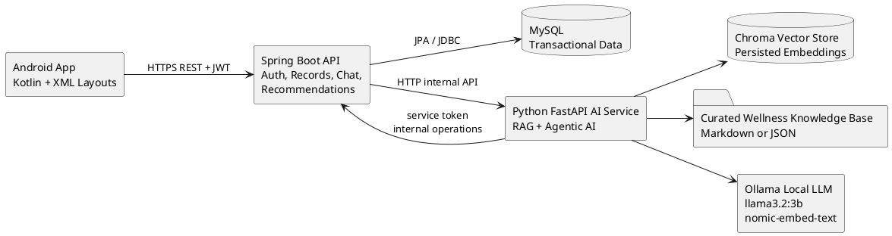
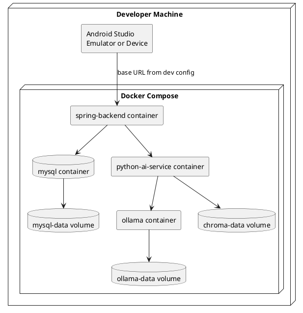
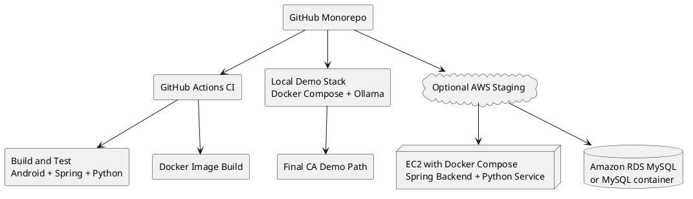
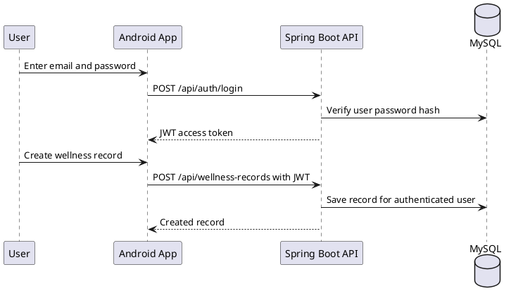
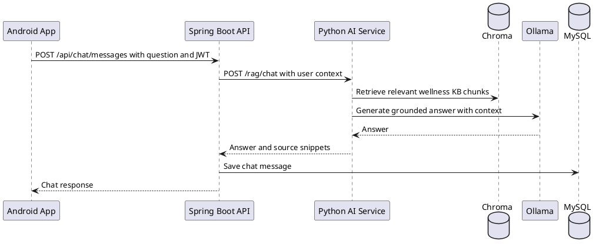
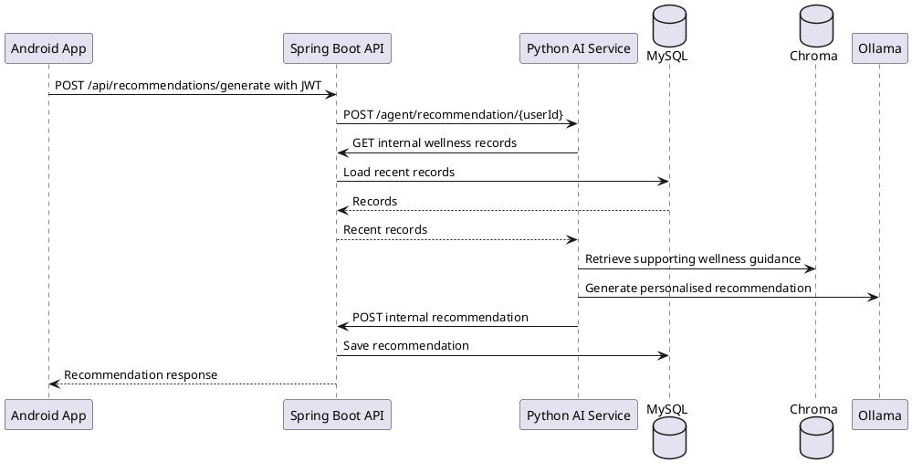

# 02 System Architecture

## Spec Metadata

| Field | Value |
| --- | --- |
| Status | Draft baseline |
| Controls | REQ-08, REQ-09, REQ-10, REQ-13, REQ-14, NFR-03 |
| Primary audience | Full team |
| Upstream specs | `02-specify-project-requirements.md` |
| Downstream specs | ERD, API, Android UI, RAG, agent, Docker, test plan |

## Logical Architecture

## Responsibility Boundaries

| Component | Responsibilities | Must Not Do |
| --- | --- | --- |
| Android app | UI, form validation, token storage, REST calls to backend | Direct database access, direct Python AI calls |
| Spring Boot backend | Auth, JWT, authorization, business rules, MySQL persistence, AI service orchestration | Local embedding/vector logic |
| MySQL | Durable transactional data | Store vector embeddings unless specs change |
| Python AI service | RAG indexing/retrieval, Ollama calls, recommendation generation | Own user authentication or bypass backend authorization |
| Chroma | Local vector index persistence | Replace MySQL transactional storage |
| Ollama | Local generation and embeddings | Cloud or paid LLM calls |

## Runtime Architecture

## Optional AWS Hybrid Staging

AWS is optional and should not become the only demo path.

Recommended AWS usage:

- Use AWS only for shared backend/database staging if the team has time.
- Keep local Docker as the final demo path because the LLM must be free/local.
- Prefer a single EC2 instance running Docker Compose for low setup complexity.
- Use RDS only if the team already has AWS Academy or free-tier confidence.

## Main User Flows

### Login And Wellness CRUD

### RAG Chatbot

### Agentic Recommendation

