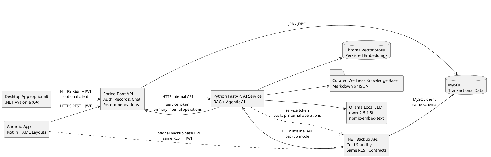
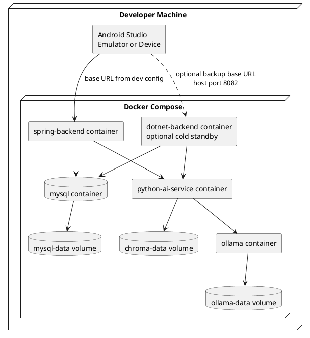
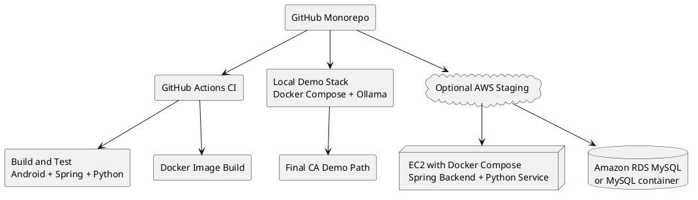
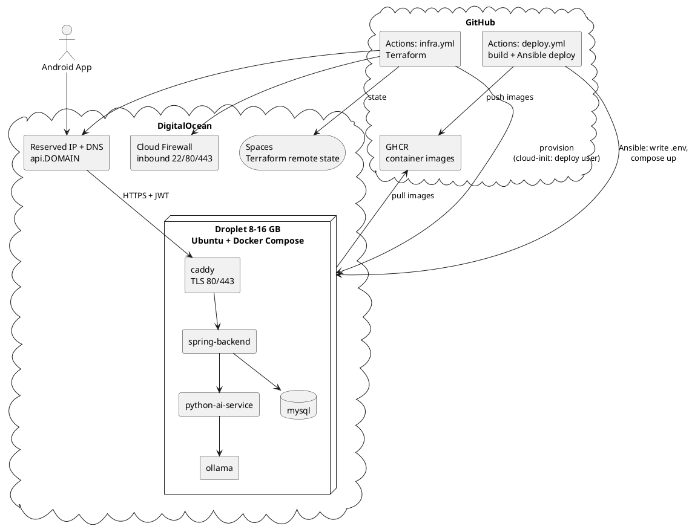
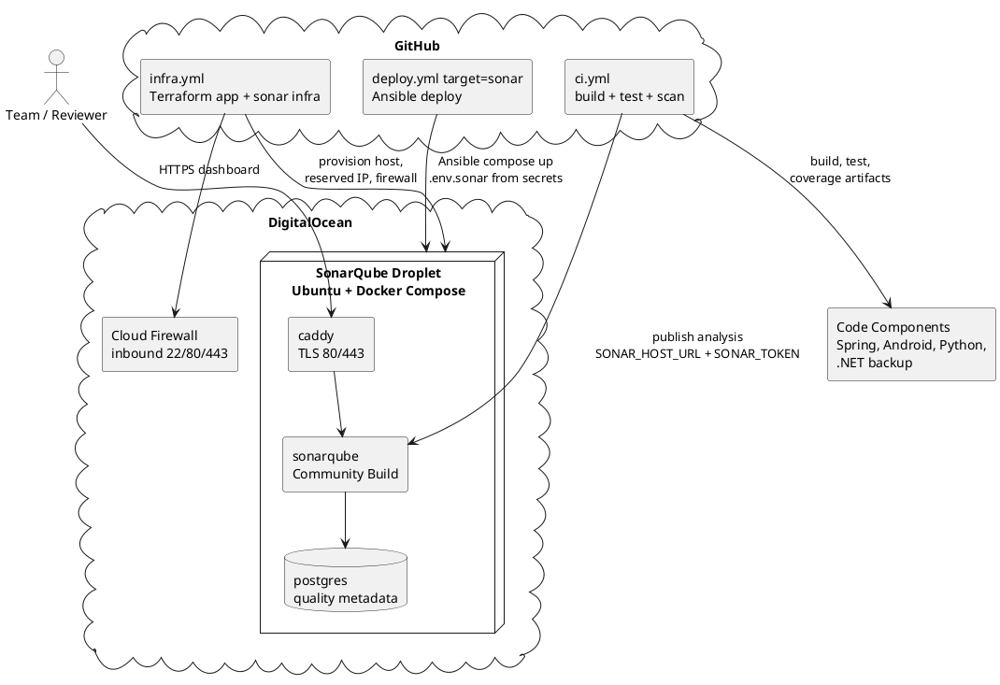
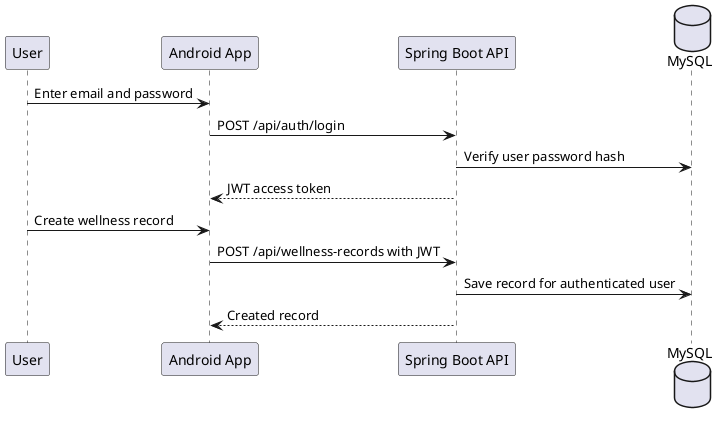
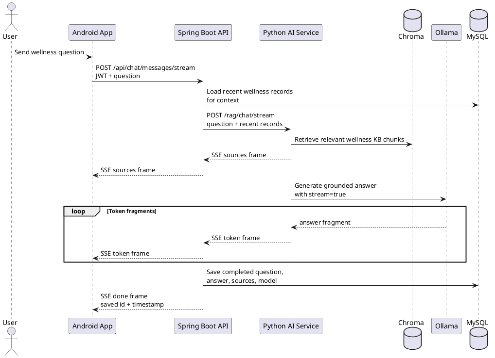
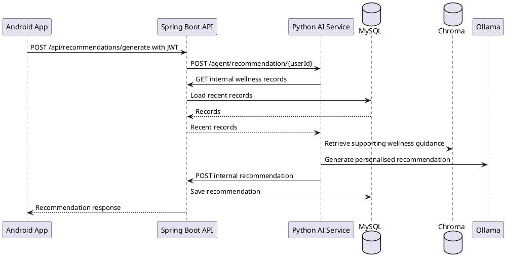

# 02 System Architecture

<!-- @author Tiong Zhong Cheng -->

## Spec Metadata

| Field | Value |
| --- | --- |
| Status | Draft baseline |
| Controls | REQ-08, REQ-09, REQ-10, REQ-13, REQ-14, REQ-16, NFR-03 |
| Primary audience | Full team |
| Upstream specs | `02-specify-project-requirements.md` |
| Downstream specs | ERD, API, Android UI, RAG, agent, Docker, test plan |

## Logical Architecture

The Java Spring Boot backend remains the primary and canonical backend because `REQ-08` requires Spring Boot. The `.NET Backup API` is optional cold-standby evidence only. It must mirror the Spring Boot wire contracts and MySQL schema, but it must not replace Spring Boot as the required CA backend.

## Responsibility Boundaries

| Component | Responsibilities | Must Not Do |
| --- | --- | --- |
| Android app | UI, form validation, token storage, REST calls to backend | Direct database access, direct Python AI calls |
| Desktop app (optional) | UI, form validation, in-memory token storage, REST calls to backend (parity with Android) | Direct database access, direct Python AI calls, persisting JWT to disk |
| Spring Boot backend | Auth, JWT, authorization, business rules, MySQL persistence, AI service orchestration | Local embedding/vector logic |
| .NET backup backend | Optional cold-standby REST mirror of Spring contracts for backup rehearsal | Replace Spring as the required backend, change API contracts independently |
| MySQL | Durable transactional data | Store vector embeddings unless specs change |
| Python AI service | RAG indexing/retrieval, Ollama calls, recommendation generation | Own user authentication or bypass backend authorization |
| Chroma | Local vector index persistence | Replace MySQL transactional storage |
| Ollama | Local generation and embeddings | Cloud or paid LLM calls |
| SonarQube Community Build | Optional quality dashboard for maintainability, reliability, duplication, reviewed security issues, and coverage evidence | Replace tests, Codex Security review, SCA, secret scanning, or the local demo path |

## Runtime Architecture

Local demo default remains `spring-backend` on port `8080`. Backup rehearsal may run `dotnet-backend` on port `8082` and point Android or Python service callbacks to it explicitly. Do not place a gateway or automatic failover in the main demo path unless a later spec revision accepts the added complexity.

## Optional AWS Hybrid Staging

AWS is optional and should not become the only demo path.

Recommended AWS usage:

- Use AWS only for shared backend/database staging if the team has time.
- Keep local Docker as the final demo path because the LLM must be free/local.
- Prefer a single EC2 instance running Docker Compose for low setup complexity.
- Use RDS only if the team already has AWS Academy or free-tier confidence.

## DigitalOcean Production Deployment

The chosen production topology: a single DigitalOcean Droplet runs the full Docker
Compose stack with Ollama on-server. Caddy is the only public service and
terminates TLS for `api.<domain>`. Infrastructure is provisioned with Terraform;
images are built by GitHub Actions and the host is configured and deployed with
Ansible (`infra/ansible/`); secrets live in GitHub Actions secrets. See
`10-plan-docker-devops.md` for the operational detail.

Deployment rules:

- Only Caddy (80/443) and SSH (22) are reachable; MySQL, Ollama, Python AI, and
  Spring Boot stay on the internal Docker network.
- No secrets are committed, stored in Terraform state, or placed in cloud-init —
  the Ansible deploy renders `.env` on the Droplet from GitHub Actions secrets
  (read from the environment, never the process argv).
- Ollama remains local to the Droplet, satisfying the free/local LLM constraint
  without any paid cloud inference.

## Quality Dashboard Architecture

SonarQube Community Build is a separate quality-evidence stack, not part of the
wellness app runtime. It supports `REQ-16` by giving reviewers a dashboard for
code quality, maintainability, duplication, reliability issues, reviewed
security findings, and imported coverage where configured. It does not replace
unit tests, Android/manual QA, Codex Security scans, SCA, or secret scanning.

Quality rules:

- SonarQube runs on a separate local or DigitalOcean stack (`docker-compose.sonar.yml`);
  it is not started by the default wellness app demo command.
- CI scans Spring, Android, Python, and the optional `.NET Backup API` as separate
  projects when `SONAR_HOST_URL` and `SONAR_TOKEN` are configured.
- Spring coverage evidence is imported from JaCoCo XML produced by Maven
  `verify`; Python coverage is imported from `coverage.xml` where configured.
- The SonarQube host exposes only Caddy and SSH publicly; PostgreSQL and
  SonarQube's internal port stay private.

## Main User Flows

### Login And Wellness CRUD

### RAG Chatbot With Streaming

Streaming is the preferred Android path because local Ollama generation can take
tens of seconds on CPU-only machines or small droplets. Spring Boot still owns
authentication, context loading, persistence, and the Android-facing SSE
contract. Python owns retrieval and Ollama streaming. The blocking
`POST /api/chat/messages` -> `POST /rag/chat` path remains as a fallback for
clients that cannot consume Server-Sent Events.

### Agentic Recommendation

