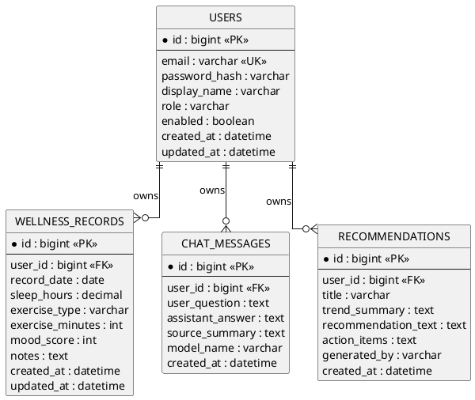

# 03 Backend ERD

## Spec Metadata

| Field | Value |
| --- | --- |
| Status | Draft baseline |
| Controls | REQ-09, REQ-15, NFR-01 |
| Primary audience | Backend, AI integration, test owners |
| Upstream specs | `02-specify-project-requirements.md`, `04-plan-system-architecture.md` |
| Downstream specs | `06-plan-api-contracts.md`, `15-validate-test-and-demo-plan.md` |

## MySQL Data Model

## Entity Notes

### Users

- Stores account identity and authentication metadata.
- `email` must be unique and lowercased before persistence.
- `password_hash` stores a BCrypt hash, never a plain password. It is **nullable**: Google SSO users (see [DEC-013/DEC-014](03-clarify-decisions-and-edge-cases.md)) have no local password and are persisted with `password_hash = NULL`.
- Because `password_hash` is nullable, the email/password login path must treat a null hash as a non-matching credential (BCrypt match fails), so SSO accounts cannot be logged into with a password.
- `role` can default to `USER`.
- `enabled` allows future account disabling.

> **Migration note:** Existing databases created before `password_hash` became nullable still carry a `NOT NULL` constraint, and `hibernate.ddl-auto: update` does not relax it. Run `ALTER TABLE users MODIFY password_hash VARCHAR(255) NULL;` (or recreate the volume) before enabling SSO. See the troubleshooting table in `docs/local-sso-quickstart.md`.

### Wellness Records

- Stores user-entered wellness observations.
- `record_date` is the date the record describes, not necessarily the creation date.
- `sleep_hours` should allow decimal values such as `7.5`.
- `mood_score` should use a 1 to 5 scale.
- Records are always scoped to exactly one user.

### Chat Messages

- Stores each user question and assistant answer.
- `source_summary` stores the retrieved RAG source titles or short snippets used to answer.
- `model_name` stores the local Ollama generation model, for example `llama3.2:3b`.

### Recommendations

- Stores Python agent outputs.
- `trend_summary` explains what the agent noticed in recent wellness records.
- `action_items` stores short, practical next steps.
- `generated_by` can default to `python-agent`.

## Indexing Requirements

- `users.email`: unique index.
- `wellness_records.user_id, record_date`: supports historical record retrieval.
- `chat_messages.user_id, created_at`: supports chat history display.
- `recommendations.user_id, created_at`: supports latest recommendations display.

## Data Ownership Rule

Every query for wellness records, chat messages, and recommendations must filter by the authenticated user id. The backend must not allow one user to access another user data by guessing ids.

## RAG Storage Boundary

RAG source documents and embeddings live outside MySQL:

- Curated source files live in `rag-knowledge-base/` during implementation.
- Vector embeddings live in Chroma persistent storage.
- MySQL only stores chat outputs, source summaries, and recommendations needed by the app.
