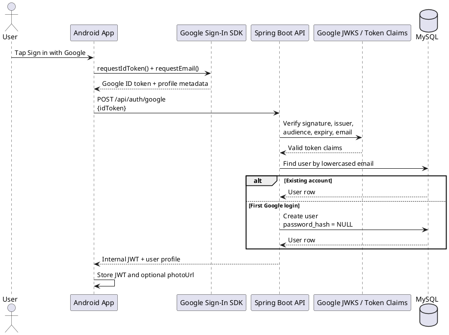
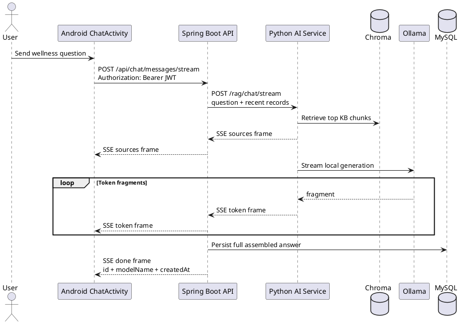

# 04 API Spec

<!-- @author Tiong Zhong Cheng -->

## Spec Metadata

| Field            | Value                                                                         |
| ---------------- | ----------------------------------------------------------------------------- |
| Status           | Draft baseline                                                                |
| Controls         | REQ-02 through REQ-13, REQ-23, NFR-01, NFR-02                                 |
| Primary audience | Backend, Android, Python AI service, test owners                              |
| Upstream specs   | `04-plan-system-architecture.md`, `05-plan-backend-data-model-erd.md`         |
| Downstream specs | Android implementation, backend implementation, Python service clients, tests |

## API Principles

- REST clients (Android, and the optional .NET desktop client) call only the Spring Boot API.
- Java Spring Boot is the canonical backend API for assignment evidence. The optional `.NET Backup API` may expose the same routes for cold-standby rehearsal, but it must not define divergent behavior.
- All non-auth endpoints require `Authorization: Bearer <jwt>`.
- Public status endpoints may be exposed for local browser and health checks.
- Backend derives the current user from JWT claims, not from client-provided user ids.
- Every protected endpoint requires the `USER` role (Spring `hasRole(USER)`; the .NET Backup API applies the same gate, defaulting to the `USER` role). Role is authoritative from the database-loaded user, not the token, so a stale token can never elevate privileges; the JWT `role` claim is informational only. A request from an authenticated user lacking the required role returns `403 Forbidden`. The `PREMIUM_USER` role exists but is not required by any endpoint yet.
- JSON is the request and response format.
- Error responses use one consistent shape.

## Optional .NET Backup Parity

If the `.NET Backup API` is implemented, it must preserve Spring Boot parity:

- Same route paths, HTTP methods, request fields, response fields, status codes, and camelCase JSON names.
- Same MySQL table and column ownership rules defined in `05-plan-backend-data-model-erd.md`.
- Same JWT secret, expiry setting, HS256 signing, bearer-token rules, and claims: `sub`, `uid`, `name`, `role`, `iat`, `exp`. The `role` claim carries the canonical enum name (e.g. `USER`).
- BCrypt password hashes must be compatible with Spring Security so either backend can authenticate users stored by the other.
- Optional Google SSO (`POST /api/auth/google`) uses the same Web Client ID and ID-token validation rules in Spring and the `.NET Backup API`; SSO-only users have `password_hash = NULL` in the shared schema.
- Internal Python callbacks must use `X-Internal-Service-Token` and the same internal endpoint request/response shapes.
- If optional `REQ-23` is implemented in the backup API, account export/delete routes must mirror Spring's request/response shapes and ownership behavior.
- Spring remains the source of truth when a contract ambiguity appears.

## Contract Flow Diagrams

These diagrams clarify the contract paths that are easiest to mis-wire during
implementation.

### Google SSO Exchange



Rules reinforced by this flow:

- Android never sends the Google token to Python or MySQL directly.
- Google SSO returns the same internal JWT shape as email/password login.
- A null `password_hash` is valid only for SSO-provisioned users; it does not
  enable password login.

### Streamed Chat Path



Failure rule: once the SSE response is open, mid-stream failures are represented
as a terminal `error` frame rather than a new HTTP status code.

## Public Status Endpoints

### Backend Status

`GET /`

Response `200 OK`:

```json
{
  "service": "wellness-backend",
  "status": "UP",
  "health": "/actuator/health"
}
```

This endpoint is intentionally public for local development checks. It must not expose secrets, user data, stack traces, or database details.

### Health

`GET /actuator/health`

Response `200 OK`:

```json
{
  "status": "UP"
}
```

## Error Response

```json
{
  "timestamp": "2026-07-01T10:30:00Z",
  "status": 400,
  "error": "Bad Request",
  "message": "Mood score must be between 1 and 5",
  "path": "/api/wellness-records"
}
```

## Auth Endpoints

### Register

`POST /api/auth/register`

Request:

```json
{
  "displayName": "Asha Tan",
  "email": "asha@example.com",
  "password": "Password123!"
}
```

Response `201 Created`:

```json
{
  "id": 1,
  "displayName": "Asha Tan",
  "email": "asha@example.com"
}
```

Validation:

- Email is required and unique.
- Password is required and should be at least 8 characters.
- Display name is required.

### Account Profile

`GET /api/account/profile`

Returns the authenticated user's profile fields needed by the Profile screen and BMI calculation.

Response `200 OK`:

```json
{
  "id": 1,
  "displayName": "Asha Tan",
  "email": "asha@example.com",
  "heightCm": 170,
  "createdAt": "2026-07-01T10:30:00Z"
}
```

`PUT /api/account/profile`

Request:

```json
{
  "heightCm": 170
}
```

Response `200 OK`:

```json
{
  "id": 1,
  "displayName": "Asha Tan",
  "email": "asha@example.com",
  "heightCm": 170,
  "createdAt": "2026-07-01T10:30:00Z"
}
```

Validation:

- Height is optional, but when provided it must be positive.
- Only the authenticated owner may read or update the profile.

### Login

`POST /api/auth/login`

Request:

```json
{
  "email": "asha@example.com",
  "password": "Password123!"
}
```

Response `200 OK`:

```json
{
  "token": "jwt-token",
  "tokenType": "Bearer",
  "expiresInSeconds": 86400,
  "user": {
    "id": 1,
    "displayName": "Asha Tan",
    "email": "asha@example.com"
  }
}
```

### Google SSO (optional — REQ-22)

`POST /api/auth/google`

Additional login path. The Android client obtains a Google ID token via the Google Sign-In SDK and exchanges it here. No JWT is required to call this endpoint (`/api/auth/**` is public).

Request:

```json
{
  "idToken": "<google-id-token>",
  "reactivate": false
}
```

`reactivate` is optional and defaults to `false`. Android sets it to `true` only after a user confirms the reactivation prompt for a deactivated Google-only account.

The backend verifies the token before trusting it:

- Signature against Google's JWKS (`https://www.googleapis.com/oauth2/v3/certs`).
- `aud` claim equals the configured Web Client ID (`app.google.client-id` / `GOOGLE_CLIENT_ID`).
- `iss` claim is `accounts.google.com` (or `https://accounts.google.com`).
- `exp` not expired; `email` claim present.

On success the user is looked up by email; a new user is auto-provisioned (display name from the token, `password_hash = NULL`), an existing user is reused. If a Google-only account was previously deactivated, the backend first returns `403` after verifying the token so Android can ask whether the user wants to reactivate. Only a confirmed retry with `reactivate=true` reactivates that same account before issuing a JWT. The backend then issues the **same** JWT format as `/api/auth/login`.

Response `200 OK`:

```json
{
  "token": "jwt-token",
  "tokenType": "Bearer",
  "expiresInSeconds": 86400,
  "user": {
    "id": 1,
    "displayName": "Asha Tan",
    "email": "asha@example.com"
  }
}
```

Errors:

- `400` if `idToken` is missing or blank.
- `401` if the token is invalid, expired, or has the wrong audience/issuer.
- `403` if the matched account is deactivated and `reactivate` was not confirmed, or if a matched account cannot be reactivated by the verified Google identity.

### Logout

`POST /api/auth/logout`

Response `204 No Content`.

Logout is stateless. The Android app clears the stored JWT after this call succeeds or if the user chooses local logout.

## Account Privacy Endpoints (optional — REQ-23 / S-03)

These endpoints are authenticated user-facing routes owned by Spring Boot. Android uses them from the Privacy screen launched from Profile. They must never be called directly against MySQL or the Python AI service.

### Export Account Data

`GET /api/account/export`

Response `200 OK`:

```json
{
  "schemaVersion": "1.0",
  "exportedAt": "2026-07-08T10:30:00Z",
  "user": {
    "id": 1,
    "displayName": "Asha Tan",
    "email": "asha@example.com",
    "role": "USER",
    "createdAt": "2026-07-01T09:00:00Z"
  },
  "wellnessRecords": [
    {
      "id": 10,
      "recordDate": "2026-07-01",
      "sleepHours": 7.5,
      "exerciseType": "Walking",
      "exerciseMinutes": 30,
      "moodScore": 4,
      "notes": "Felt more energetic after dinner walk.",
      "createdAt": "2026-07-01T12:00:00Z",
      "updatedAt": "2026-07-01T12:00:00Z"
    }
  ],
  "chatMessages": [
    {
      "id": 25,
      "question": "How can I improve my sleep routine?",
      "answer": "Try keeping a consistent bedtime and a calming wind-down routine.",
      "sourceSummary": "Sleep Hygiene Basics",
      "modelName": "qwen2.5:1.5b",
      "createdAt": "2026-07-01T12:10:00Z"
    }
  ],
  "recommendations": [
    {
      "id": 8,
      "title": "Improve sleep consistency",
      "trendSummary": "Your sleep has varied between 5.5 and 8 hours over the last week.",
      "recommendationText": "Aim for a consistent bedtime and keep evening exercise light.",
      "actionItems": [
        "Set a fixed bedtime for the next three nights",
        "Take a 20 minute walk before 8pm"
      ],
      "generatedBy": "python-agent",
      "createdAt": "2026-07-01T12:20:00Z"
    }
  ]
}
```

Rules:

- Includes only rows owned by the authenticated user.
- Excludes `passwordHash`/`password_hash`, raw JWTs, internal service tokens, OAuth tokens, database connection details, and other users' data.
- Uses `application/json`; Android may save/share the payload as a `.json` file through the system share sheet.
- Returns the standard error shape for missing/invalid JWT or unexpected export failure.

### Delete Account

`DELETE /api/account`

Request body for local email/password accounts:

```json
{
  "password": "Password123!"
}
```

For SSO-only accounts with `password_hash = NULL`, Android may send an empty body field or `null` password after a destructive confirmation because there is no app password to re-enter.

Response `204 No Content`.

Behavior:

- Deletes the authenticated user's wellness records, chat messages, recommendations, and user row in one backend transaction.
- Local email/password accounts must reconfirm the current password before deletion; SSO-only accounts are authorized by the currently valid JWT because they have no local app password.
- Does not call Python AI or delete shared RAG knowledge-base/vector assets because the current RAG design has no user-uploaded documents.
- After success, Android clears the local JWT and returns to Login.
- A previous stateless JWT for the deleted account must no longer authorize protected endpoints because the user lookup fails.

Errors:

- `401` for missing/invalid JWT.
- `404` if the authenticated user row no longer exists.
- `400` if a local email/password account omits the password or provides the wrong password.
- `500` using the standard error shape if transactional deletion fails.

## Wellness Record Endpoints

### Create Record

`POST /api/wellness-records`

Request:

```json
{
  "recordDate": "2026-07-01",
  "sleepHours": 7.5,
  "weightKg": 65.4,
  "exerciseType": "Walking",
  "exerciseMinutes": 30,
  "moodScore": 4,
  "notes": "Felt more energetic after dinner walk."
}
```

Response `201 Created`:

```json
{
  "id": 10,
  "recordDate": "2026-07-01",
  "sleepHours": 7.5,
  "weightKg": 65.4,
  "exerciseType": "Walking",
  "exerciseMinutes": 30,
  "moodScore": 4,
  "notes": "Felt more energetic after dinner walk.",
  "createdAt": "2026-07-01T12:00:00Z",
  "updatedAt": "2026-07-01T12:00:00Z"
}
```

### List Records

`GET /api/wellness-records?from=2026-06-01&to=2026-07-01`

Response `200 OK`:

```json
[
  {
    "id": 10,
    "recordDate": "2026-07-01",
    "sleepHours": 7.5,
    "weightKg": 65.4,
    "exerciseType": "Walking",
    "exerciseMinutes": 30,
    "moodScore": 4,
    "notes": "Felt more energetic after dinner walk.",
    "createdAt": "2026-07-01T12:00:00Z",
    "updatedAt": "2026-07-01T12:00:00Z"
  }
]
```

### Get Record

`GET /api/wellness-records/{id}`

Returns `404 Not Found` if the record does not exist for the authenticated user.

### Update Record

`PUT /api/wellness-records/{id}`

Uses the same request shape as create. Returns the updated record.

### Delete Record

`DELETE /api/wellness-records/{id}`

Response `204 No Content`.

## Chatbot Endpoints

### Ask Chatbot

`POST /api/chat/messages`

Request:

```json
{
  "question": "How can I improve my sleep if I exercise in the evening?"
}
```

Response `200 OK`:

```json
{
  "id": 25,
  "question": "How can I improve my sleep if I exercise in the evening?",
  "answer": "Try keeping evening exercise moderate and leave time to wind down before bed.",
  "sources": [
    {
      "title": "Sleep Hygiene Basics",
      "snippet": "A calming routine and consistent bedtime support better sleep quality."
    }
  ],
  "modelName": "qwen2.5:1.5b",
  "createdAt": "2026-07-01T12:10:00Z"
}
```

Behavior:

- Backend forwards the question and recent wellness context to Python.
- Python retrieves relevant KB chunks and calls Ollama.
- Backend saves the final question, answer, source summary, and model name.

### Ask Chatbot (Streaming)

`POST /api/chat/messages/stream`

Same request body as `POST /api/chat/messages`, but the answer streams back token-by-token
so long responses are not truncated and the user sees progress immediately.

Response `200 OK` with `Content-Type: text/event-stream`. Each Server-Sent Events `data:`
line carries one JSON frame tagged with a `type`:

```text
data: {"type":"sources","sources":[{"title":"Sleep Hygiene Basics","snippet":"..."}]}

data: {"type":"token","text":"Try keeping "}

data: {"type":"token","text":"evening exercise moderate."}

data: {"type":"done","id":25,"modelName":"qwen2.5:1.5b","createdAt":"2026-07-01T12:10:00Z","sources":[{"title":"Sleep Hygiene Basics","snippet":"..."}]}
```

Behavior:

- `sources` is emitted once, before generation, from the retrieved KB chunks.
- `token` frames carry answer fragments in order; concatenate them to form the full answer.
- `done` is the terminal success frame, sent only after the backend has persisted the
  assembled exchange (so a subsequent history load returns the same message).
- On failure a terminal `{"type":"error","message":"..."}` frame is sent instead; because
  the `200 OK` status is already committed when streaming starts, errors mid-stream surface
  as this frame rather than an HTTP error status.
- The non-streaming `POST /api/chat/messages` remains available as a fallback and for
  clients that do not consume SSE.

### List Chat History

`GET /api/chat/messages`

Returns chat messages for the authenticated user, newest first.

## Recommendation Endpoints

### Generate Recommendation

`POST /api/recommendations/generate`

Response `201 Created`:

```json
{
  "id": 8,
  "title": "Improve sleep consistency",
  "trendSummary": "Your sleep has varied between 5.5 and 8 hours over the last week.",
  "recommendationText": "Aim for a consistent bedtime and keep evening exercise light on days when sleep was below 6 hours.",
  "actionItems": [
    "Set a fixed bedtime for the next three nights",
    "Take a 20 minute walk before 8pm",
    "Avoid caffeine after lunch"
  ],
  "generatedBy": "python-agent",
  "createdAt": "2026-07-01T12:20:00Z"
}
```

### List Recommendations

`GET /api/recommendations`

Returns recommendations for the authenticated user, newest first.

## Internal Backend Endpoints

Internal endpoints are called by the Python AI service only. They require an internal service token, not a user JWT.

- `GET /api/internal/users/{userId}/wellness-records?days=14`
- `POST /api/internal/users/{userId}/recommendations`

These endpoints must not be exposed to Android.

## Python AI Service Endpoints

These endpoints are called by Spring Boot.

### RAG Chat

`POST /rag/chat`

Request:

```json
{
  "userId": 1,
  "question": "How can I improve my sleep?",
  "recentRecords": [
    {
      "recordDate": "2026-07-01",
      "sleepHours": 6,
      "exerciseType": "Running",
      "exerciseMinutes": 40,
      "moodScore": 3
    }
  ]
}
```

Response:

```json
{
  "answer": "A consistent bedtime and a calming routine may help improve sleep.",
  "sources": [
    {
      "title": "Sleep Hygiene Basics",
      "snippet": "Consistent sleep schedules support sleep quality."
    }
  ],
  "modelName": "qwen2.5:1.5b"
}
```

### RAG Chat (Streaming)

`POST /rag/chat/stream`

Same request body as `POST /rag/chat`. Returns `Content-Type: text/event-stream`.
Retrieval runs first so `sources` is known up front, then Ollama generation tokens are
forwarded as they arrive:

```text
data: {"type":"sources","sources":[{"title":"Sleep Hygiene Basics","snippet":"..."}]}

data: {"type":"token","text":"A consistent "}

data: {"type":"done","modelName":"qwen2.5:1.5b"}
```

Spring Boot consumes this stream, forwards `sources`/`token` frames to Android, accumulates
the full answer, persists it, and emits the enriched `done` frame (with saved id and
timestamp). If Ollama is unreachable mid-stream, Python emits a terminal
`{"type":"error","message":"..."}` frame.

### Agent Recommendation

`POST /agent/recommendation/{userId}`

Response uses the recommendation response shape after saving through Spring Boot.

### Reindex Knowledge Base

`POST /rag/reindex`

Development-only endpoint to rebuild the local vector index from curated KB files.
