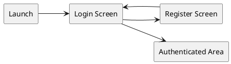
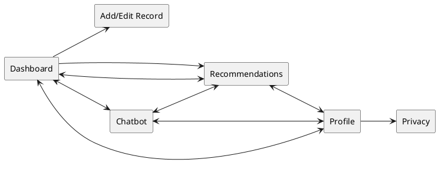
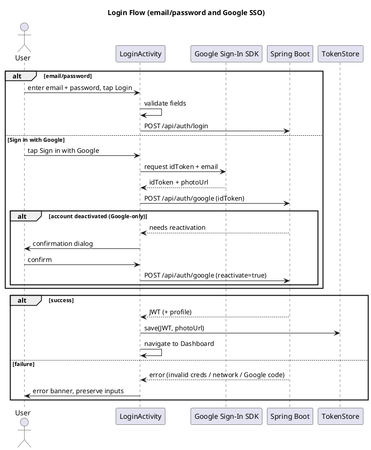
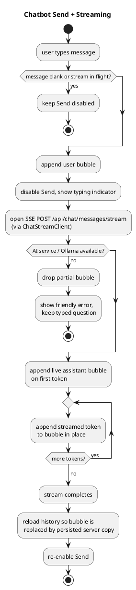
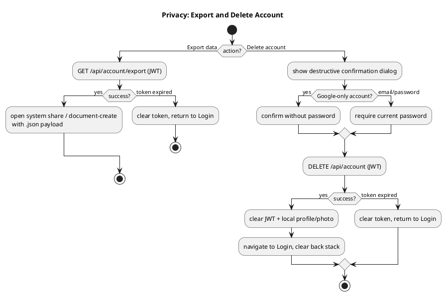

# 05 Android UI Spec

<!-- @author Tiong Zhong Cheng, Abu Bakar Nasir -->

## Spec Metadata

| Field | Value |
| --- | --- |
| Status | Draft baseline |
| Controls | REQ-01, REQ-02, REQ-04 through REQ-07, REQ-10, REQ-13, REQ-23, NFR-02, NFR-04 |
| Primary audience | Android owners, backend owners, demo owner |
| Upstream specs | `02-specify-project-requirements.md`, `06-plan-api-contracts.md` |
| Downstream specs | Android layouts, ViewModels, manual QA checklist |

## Figma UI Specification

Figma file: [SA62 Wellness Android UI Spec](https://www.figma.com/design/C8xBLWCbQfWMD7dIiVaf8c/SA62-Wellness-Android-UI-Spec?t=re8jTqWW4UALHDKv-0)

The Figma file is the visual handoff for Android XML implementation. It contains:

- `00 Overview`: app flow map and requirement trace.
- `01 Design System`: colors, typography, spacing, component inventory, and reusable local components.
- `02 Auth`: login and register phone frames.
- `03 App Screens`: dashboard, add/edit record, chatbot, recommendations, and profile phone frames.
- `04 States`: loading, empty, error, success, and local AI waiting phone frames.
- `05 Dashboard`: today's snapshot tiles, the Sleep/Activity/Mood metric cards with sparklines and status badges, the AI insight teaser, and the historical records list with the date-range filter chip.

The Dashboard is the authenticated landing view. It replaces the raw records list as the first tab while keeping the historical record cards rendered beneath the summary section. The data, aggregation, and threshold rules that drive these frames are defined in [Wellness Dashboard Logic](#wellness-dashboard-logic) below.

All phone frames use `360 x 800dp` as the compact Android portrait reference size.

## UI Technology

- Kotlin Android app.
- XML layouts, not Jetpack Compose.
- Retrofit for backend REST calls.
- `AppCompatActivity` as the base class for every screen (not the bare `android.app.Activity`).
- View Binding (`viewBinding true`) generates typed layout accessors; do not use `findViewById`.
- Explicit-`Intent` navigation between screens (`startActivity(Intent(this, TargetActivity::class.java))`) — no Fragments, no Navigation Component; this course's syllabus doesn't cover them.
- `ListView` with a custom `ArrayAdapter` (`getView` + view-holder pattern) for records, chat history, and recommendation lists — not `RecyclerView`.
- API client read/call timeouts must allow slow local Ollama responses for chatbot and recommendation generation.
- ViewModel and LiveData or StateFlow for screen state.
- Secure token storage for JWT.

## Visual Design Tokens

Use the Figma design tokens as the Android XML resource target. Resource names may be adjusted to match Android naming rules, but semantic meaning should stay the same.

### Color Roles

| Role | Figma token | Android target | Usage |
| --- | --- | --- | --- |
| Primary | `color/bg/primary` | `@color/primary` | Primary buttons, selected nav item, positive wellness accents |
| Secondary | `color/bg/secondary` | `@color/secondary` | Secondary information accents |
| App background | `color/bg/app` | `@color/bg_app` | Screen background |
| Surface | `color/bg/surface` | `@color/bg_surface` | Cards, forms, top bar, bottom navigation |
| Subtle surface | `color/bg/subtle` | `@color/bg_subtle` | Recommendation cards, selected states, soft wellness panels |
| Warning | `color/bg/warning` | `@color/warning` | Caution or slow local AI notices |
| Error | `color/bg/error` | `@color/error` | Validation and service failure states |
| Text primary | `color/text/primary` | `@color/text_primary` | Main content text |
| Text secondary | `color/text/secondary` | `@color/text_secondary` | Metadata, helper text, secondary copy |
| Text on primary | `color/text/on-primary` | `@color/text_on_primary` | Text on primary/error filled buttons |
| Border default | `color/border/default` | `@color/border_default` | Cards and text field outlines |
| Border focus | `color/border/focus` | `@color/border_focus` | Focused text fields and selected controls |
| Badge excellent | `color/badge/excellent` | `@color/badge_excellent` | "Excellent" status pill on dashboard metric cards (`#2E7D32`) |
| Badge good | `color/badge/good` | `@color/badge_good` | "Good" status pill on dashboard metric cards (`#00695C`) |
| Badge fair | `color/badge/fair` | `@color/badge_fair` | "Fair" status pill on dashboard metric cards (`#E65100`) |
| Metric line/bar | `color/metric/green` | `@color/metric_green` | Activity sparkline bars (`#43A047`) |
| Metric accent | `color/metric/amber` | `@color/metric_amber` | Mood sparkline line and dots (`#FB8C00`) |

Status-badge colors map directly to the weekly-average thresholds in [Wellness Dashboard Logic](#status-badge-thresholds). "Below Target" reuses `@color/error` and "No Data" reuses `@color/text_secondary`; Sleep sparklines reuse `@color/secondary` (blue).

### Typography

- Font family: Roboto.
- Screen headline: 28sp bold.
- App bar title: 22sp bold.
- Section/card heading: 18sp medium.
- Body text: 16sp regular.
- Button text: 14sp medium.
- Caption/helper text: 12sp regular.
- Letter spacing remains `0`.

### Spacing, Shape, And Touch Targets

- Base spacing follows an 8dp rhythm: 4, 8, 12, 16, 24, 32, 48.
- Minimum tappable control size: 48dp.
- Text fields and primary controls should be at least 48dp high.
- Cards use 12-16dp corner radius.
- Larger panels and dialog-like state blocks may use 20-24dp radius.
- Use restrained elevation for cards; avoid heavy shadows.

## Reusable UI Components

The Figma file defines reusable local components for Android implementation:

- App bar.
- Bottom navigation item, selected and default.
- Primary, secondary, and destructive buttons.
- Default and error text fields.
- Wellness record card.
- Recommendation card.
- User and assistant chat bubbles.
- State block for loading, empty, error, success, and AI waiting states.
- Mood selector from 1 to 5.
- Snapshot tile (icon, value, label) used in the three-up dashboard header.
- Metric card with embedded sparkline, weekly stat line, and status badge pill.
- Status badge pill (Excellent, Good, Fair, Below Target, No Data).
- AI insight teaser card (title plus truncated excerpt) that links to Recommendations.
- Dismissible filter chip for the active date-range filter.

Android XML should map these to reusable layouts/styles where practical:

- Use a shared bottom-navigation XML bar, included in every authenticated `Activity`'s layout, whose buttons fire explicit `Intent`s to the corresponding screen — not a single-Activity tab/fragment host.
- Use `ListView` with a custom `ArrayAdapter` (row layout `row_*.xml`, view-holder pattern) for records, chat history, and recommendations — not `RecyclerView`.
- Use reusable card/item XML layouts instead of programmatically adding plain `TextView` rows.
- Use Material Components for text fields, buttons, cards, and bottom navigation if the dependency is added.

## Navigation

Before login:



After login:



Each authenticated screen (`DashboardActivity`, `ChatActivity`, `RecommendationsActivity`, `ProfileActivity`) is a separate `AppCompatActivity` including the same shared bottom-navigation XML bar. Tapping a bar item fires an explicit `Intent` to the corresponding Activity — there is no single "Home Shell" hosting fragments or swapped views. The Dashboard screen is the landing screen: it surfaces today's snapshot, weekly trends, and the historical records list. The AI insight teaser on the Dashboard deep-links into the Recommendations screen, and the add/edit record flow is opened from within the Dashboard's records section.


## Screens

### Login Screen

Fields:

- Email
- Password

Actions:

- Login
- Go to register
- Sign in with Google (optional SSO path — REQ-22, see [DEC-013](03-clarify-decisions-and-edge-cases.md))

States:

- Loading while login request is in progress.
- Inline validation for missing email or password.
- Error banner for invalid credentials or network failure.
- For Google sign-in: a status banner covering "opening Google", "signing in", and failure messages (including the Google status code) so configuration errors are visible to the developer.

Success:

- Store JWT securely.
- Navigate to Dashboard screen.

Google SSO notes:

- A "— or —" divider separates email/password from the **Sign in with Google** button.
- The button uses the Google Sign-In SDK configured with the Web Client ID (`BuildConfig.GOOGLE_WEB_CLIENT_ID`, supplied via `local.properties`) and `requestIdToken()` + `requestEmail()`.
- The returned Google ID token is exchanged at `POST /api/auth/google`; on success the same `onLoginSuccess` path stores the JWT and navigates onward.
- The account picture URL (`GoogleSignInAccount.photoUrl`) is captured alongside the ID token and stored via `TokenStore.save(..., photoUrl)` for display on the Profile screen.
- Google sign-in is also the reactivation path for Google-only deactivated accounts after the backend verifies the Google ID token. Android must show a confirmation dialog before retrying the exchange with `reactivate=true`.
- Requires a Google APIs emulator image and an Android OAuth client registered with the debug SHA-1; setup is in `docs/local-sso-quickstart.md`.



### Register Screen

Fields:

- Display name
- Email
- Password
- Confirm password

Actions:

- Register
- Back to login

Validation:

- Required display name.
- Valid email format.
- Password at least 8 characters.
- Confirm password matches.

Success:

- Show success message.
- Navigate to login screen.

### Dashboard Screen

The authenticated landing view. Replaces the standalone records list as the first bottom-nav tab; the records list is now rendered within this screen. App bar title reads "Dashboard". See [Wellness Dashboard Logic](#wellness-dashboard-logic) for aggregation and threshold rules.

Content, top to bottom:

- **Today's snapshot**: three horizontal tiles showing today's Sleep hours, Activity minutes, and Mood score. If there is no entry for today, fall back to the most recent day's values with a "No entry today" note and the fallback date.
- **Metric cards** for Sleep, Activity, and Mood, each with:
  - A sparkline trend chart (Sleep blue line, Activity green bars skipping zero-exercise days, Mood amber line with dots).
  - A weekly stat line (for example, "Avg 7.2 h · 6 days logged") over the past 7 calendar days.
  - A status badge pill (Excellent, Good, Fair, Below Target, No Data) derived from the weekly average.
- **AI insight teaser**: a card previewing the newest recommendation (title plus excerpt truncated to 120 characters). Tapping it opens the Recommendations tab; when none exist it shows a prompt to generate one.
- **Historical records** section: the scrollable record cards, with a `📅 Filter` action that opens a start-date then end-date picker and filters the list in memory. An active filter shows a dismissible chip to clear it.

Behavior:

- Loads wellness records and AI recommendations concurrently.
- Multiple records logged on the same day are consolidated for calculations (sum activity minutes, average sleep and mood).
- Records with malformed/unparseable dates are skipped silently so the screen does not crash.
- The date-range filter is client-side only and triggers no extra API calls.

States:

- Loading dashboard while records and recommendations are fetched.
- Empty state when there is no logged data yet.
- Error state when the backend is unreachable.

```plantuml
@startuml
title Dashboard Concurrent Load

participant "DashboardActivity" as Dash
participant "Spring Boot" as Backend
participant "DashboardDataHelper" as Helper

Dash -> Dash: show loading state

par load records
  Dash -> Backend: GET wellness records (JWT)
  Backend --> Dash: records
and load recommendations
  Dash -> Backend: GET recommendations (JWT)
  Backend --> Dash: recommendations
end

alt both empty
  Dash -> Dash: show empty state (prompt to add first record)
else backend unreachable
  Dash -> Dash: show error state (retry)
else data available
  Dash -> Helper: consolidate same-day records,\nskip malformed dates
  Helper -> Helper: weekly averages + badge thresholds
  Helper --> Dash: snapshot, sparklines, badges
  Dash -> Dash: render snapshot, metric cards,\nAI teaser, historical records
end
@enduml
```

### Records Screen

The records list is embedded in the Dashboard's historical records section rather than being a separate tab. The behavior below describes that list and the add/edit flow it launches.

Content:

- List of wellness records sorted by date descending.
- Empty state when no records exist.
- Pull-to-refresh or refresh action.
- Floating action button or primary button to add record.

Record item displays:

- Record date
- Sleep hours
- Exercise type and minutes
- Mood score
- Short notes preview

Actions:

- Open detail/edit screen.
- Delete record with confirmation.

States:

- Loading list.
- Empty list.
- Error loading records.
- Delete in progress.

### Add/Edit Record Screen

Fields:

- Date picker for record date
- Sleep hours numeric input
- Exercise type text input or simple spinner
- Exercise minutes numeric input
- Mood score selector from 1 to 5
- Notes multiline text

Actions:

- Save
- Cancel/back
- Delete, edit mode only

Validation:

- Date required.
- Sleep hours between 0 and 24.
- Exercise minutes 0 or greater.
- Mood score between 1 and 5.
- Notes optional.

Success:

- Return to Dashboard screen and refresh the historical records section.

### Chatbot Screen

Content:

- Scrollable chat history.
- Message input field.
- Send button.
- Source snippets are still returned by the backend and stored, but are not shown in the
  chat UI; the answer reads standalone.

Behavior:

- Send button disabled for blank messages, and while a stream is in flight to prevent duplicate submissions.
- Show typing/loading indicator until the first streamed token arrives.
- The answer streams in token-by-token: a live assistant bubble is appended immediately and
  grows in place (via `ChatStreamClient` consuming the `POST /api/chat/messages/stream` SSE
  endpoint) so long answers are never truncated. When the stream completes, history is
  reloaded so the bubble is replaced by the persisted server copy.
- Keep the request alive long enough for local Ollama generation, which may take tens of seconds on student laptops.
- Store and display previous messages loaded from backend.
- If AI service or Ollama is unavailable, drop the partial bubble, show a friendly error, and keep the typed question available.

Message display:

- User message aligned distinctly from assistant message.
- Assistant answer includes local model name only if it helps the demo.
- Source titles/snippets are collapsed or visually secondary.



### Recommendations Screen

Content:

- Latest recommendations sorted newest first.
- Generate recommendation button.
- Recommendation cards showing title, trend summary, recommendation text, action items, generated date.

States:

- Loading existing recommendations.
- Generating recommendation.
- Generating state should explain that local AI may take up to a minute.
- Empty state before first recommendation.
- Error if agent service is unavailable.

Success:

- New recommendation appears at top of list.

### Profile Screen

Content:

- Profile picture
- Display name
- Email
- Privacy and data controls entry point (optional `REQ-23` / `S-03`)
- App version or team name, optional

Actions:

- Privacy and data
- Logout

Profile picture behavior:

- Shows the user's Google account picture as a circular avatar above the display name.
- The Google picture URL is captured from the signed-in `GoogleSignInAccount` during Google SSO and persisted locally alongside the JWT (`TokenStore.photoUrl()`). It is not returned by the backend, so it is only available for Google logins.
- Loaded with Coil (`io.coil-kt:coil`) using `CircleCropTransformation`.
- Falls back to a placeholder avatar (`ic_profile_placeholder`) for email/password logins, when no picture URL is stored, or while the remote image loads/fails.
- The picture, display name, email, and app-version line are center-aligned within the profile card.

Logout behavior:

- Call backend logout endpoint.
- Clear local JWT.
- Navigate to login screen.
- If backend call fails, still allow local logout after confirmation.

### Privacy Screen (optional — REQ-23 / S-03)

Launched from Profile using an explicit `Intent`. This is a trust and data-control screen, not an onboarding or marketing page.

Content:

- Plain-language statement that wellness records, chat history, and recommendations are stored by the Spring Boot backend in MySQL for the logged-in account.
- Plain-language statement that AI runs locally through the Python AI service, Chroma, and Ollama; Android never sends wellness questions directly to Python or MySQL.
- Short data path summary: Android -> Spring Boot -> MySQL/Python AI -> local Ollama.
- Export section showing what will be included: profile, wellness records, chat messages, and recommendations.
- Delete-account section warning that deletion removes account data from MySQL and signs the user out.

Actions:

- Export data.
- Delete account.
- Back to Profile.

Behavior:

- Export calls `GET /api/account/export` with the stored JWT.
- On successful export, Android opens the system share sheet or document-create flow with a `.json` payload. The payload is not silently uploaded anywhere.
- Delete account first shows a destructive confirmation dialog. Email/password users must enter their current password; Google-only users confirm without a password because no app password exists. Only confirmation calls `DELETE /api/account`.
- On successful account deletion, Android clears the local JWT, clears locally stored profile/photo data, and navigates to Login with the back stack cleared.
- If export/delete fails because the token expired, Android clears the token and returns to Login.

States:

- Loading/exporting.
- Export success.
- Delete in progress.
- Friendly error for backend/network failure.
- Signed-out success after delete.



## Wellness Dashboard Logic

This section defines the data, aggregation, and threshold rules behind the Dashboard Screen. It is the source of truth for the dashboard's calculations and replaces the former standalone `16-android-wellness-dashboard.md` spec.

### Today's Snapshot

- Shows today's Sleep hours, Activity minutes, and Mood score in the three header tiles.
- If today has no logged entry, fall back to the most recent day's values with a "No entry today" note and the fallback date label.

### Metric Cards And Sparklines

Three cards represent Sleep, Activity, and Mood. Each shows a sparkline trend chart, a weekly stat line, and a status badge.

- Sparklines are drawn with a custom Canvas view (`SparklineView`) so no external charting dependency is added:
  - Sleep: blue line chart with a dot at the latest point.
  - Activity: green bar chart that skips zero-exercise days.
  - Mood: amber line chart with dots on all logged points.
- Weekly stat line summarizes the past 7 calendar days, for example "Avg 7.2 h · 6 days logged".

### Status Badge Thresholds

Status badges derive from the weekly averages. Comparisons are rounded to 1 decimal place to avoid floating-point edge cases (for example, an average sleep of `6.99` rounds to `7.0` and earns Good).

| Metric | Excellent | Good | Fair | Below Target |
| --- | --- | --- | --- | --- |
| Sleep average | ≥ 8.0 h | 7.0 – 7.9 h | 6.0 – 6.9 h | < 6.0 h |
| Active days | ≥ 5 days | 3 – 4 days | 1 – 2 days | 0 days |
| Mood average | ≥ 4.0 | 3.0 – 3.9 | 2.0 – 2.9 | < 2.0 |

Badge colors map to the tokens in [Color Roles](#color-roles): Excellent `@color/badge_excellent`, Good `@color/badge_good`, Fair `@color/badge_fair`, Below Target `@color/error`, No Data `@color/text_secondary`.

### AI Insight Teaser

- Shows the newest generated recommendation as a preview: title plus an excerpt truncated to 120 characters.
- Tapping it opens the Recommendations tab. When no recommendations exist, it shows a prompt to generate one.

### Historical Records And Date Filter

- The historical record cards render below the summary section.
- A `📅 Filter` action opens a start-date then end-date `DatePickerDialog` sequence and filters the list in memory; no extra API calls are triggered.
- When a filter is active, a dismissible chip appears to clear it. Range filtering is inclusive on both boundaries.

### Multi-Log Aggregation And Safety

- Deduplication: when a user logs multiple records on the same day, they are consolidated for calculations — sum exercise minutes, average sleep hours, and average mood score.
- Crash prevention: records with malformed or unparseable dates are skipped silently during calculation so a bad row cannot crash the screen.

### Implementation Notes

- `DashboardDataHelper`: pure-Kotlin helper for aggregation, date grouping, badge thresholds, and date filtering. Having no Android SDK dependency, it is unit-testable on the local JVM.
- `SparklineView`: lightweight custom `View` that overrides `onDraw` to render lines, round-rect bars, and axis labels on the native `Canvas`.
- `DashboardActivity`, `ChatActivity`, `RecommendationsActivity`, `ProfileActivity`: one `AppCompatActivity` per authenticated screen, each inflating its own XML layout via View Binding. `DashboardActivity` is the landing screen and loads wellness records and recommendations concurrently.


### Dashboard Tests

- JVM unit tests (`DashboardDataHelperTest`) cover deduplication (averaging vs. summing), defensive date parsing, rounding margins, and date-filter boundary inclusivity.
- Manual checks: load under 2 seconds, graceful empty states with zero data or an offline backend, and safe multi-tab navigation.

## User Experience Rules

- Keep labels plain and understandable.
- Show actionable error messages, not stack traces.
- Preserve form inputs after validation errors.
- Disable duplicate submissions while requests are in progress.
- Keep all authenticated screens resilient to expired JWT by returning to login.
- Match the Figma component hierarchy and spacing unless a small Android adjustment is needed for accessibility or platform behavior.
- Keep all primary actions reachable in the 360dp compact portrait layout.
- Prefer icon plus label for bottom navigation; avoid using top-row tab buttons in the authenticated shell.

## State Design Rules

Major workflows must have explicit visual states:

| Workflow | Loading | Empty | Error | Success |
| --- | --- | --- | --- | --- |
| Dashboard | Loading dashboard while records and recommendations load | Empty state with prompt to add first record | Backend unreachable retry message | Snapshot, metric cards, teaser, and records render |
| Login | Disable login button and show progress | Not applicable | Inline banner for invalid credentials or network failure | Navigate to Dashboard |
| Register | Disable register button and show progress | Not applicable | Inline validation and friendly backend error | Success message, then Login |
| Records | Loading records state | Empty records state with Add record action | Retry state for backend/network failure | Refreshed list after save/delete |
| Add/Edit Record | Save in progress | Not applicable | Inline field errors and save failure message | Return to Records and refresh |
| Chatbot | Typing/thinking indicator | Empty history with prompt suggestions | Preserve typed question and show retry message | New saved chat appears in history |
| Recommendations | Loading existing recommendations | Empty recommendations state with Generate action | Agent/Ollama unavailable retry message | New recommendation appears at top |
| Profile | Optional logout progress | Not applicable | Backend logout failure still allows confirmed local logout | Token cleared and Login shown |
| Privacy | Export/delete progress | Not applicable | Export/delete failure message; expired token returns to Login | Export share sheet opens, or account deleted and Login shown |

The local AI waiting state must explain that generation can take up to a minute and must prevent duplicate chat or recommendation submissions.

## Android Acceptance Criteria

- App supports the full demo flow from login to logout.
- Dashboard is the landing tab and shows today's snapshot, Sleep/Activity/Mood metric cards with sparklines and status badges, the AI insight teaser, and the historical records list with date-range filter.
- Dashboard status badges match the weekly-average thresholds in [Wellness Dashboard Logic](#status-badge-thresholds), and same-day records are consolidated before calculation.
- All backend calls include JWT after login.
- No screen calls MySQL or Python AI service directly.
- Required form validation works before network requests.
- Loading, empty, success, and error states exist for major workflows.
- Optional `REQ-23` Privacy screen explains local AI and account data controls, exports through Spring Boot only, and requires confirmation before account deletion.
- Android screens can be visually checked against the Figma file during manual QA.
