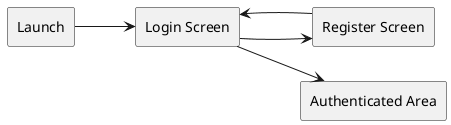
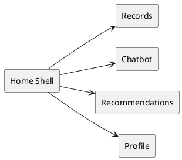

# 05 Android UI Spec

## Spec Metadata

| Field | Value |
| --- | --- |
| Status | Draft baseline |
| Controls | REQ-01, REQ-02, REQ-04 through REQ-07, REQ-10, REQ-13, NFR-02, NFR-04 |
| Primary audience | Android owners, backend owners, demo owner |
| Upstream specs | `02-specify-project-requirements.md`, `06-plan-api-contracts.md` |
| Downstream specs | Android layouts, ViewModels, manual QA checklist |

## Figma UI Specification

Figma file: [SA62 Wellness Android UI Spec](https://www.figma.com/design/C8xBLWCbQfWMD7dIiVaf8c)

The Figma file is the visual handoff for Android XML implementation. It contains:

- `00 Overview`: app flow map and requirement trace.
- `01 Design System`: colors, typography, spacing, component inventory, and reusable local components.
- `02 Auth`: login and register phone frames.
- `03 App Screens`: records, add/edit record, chatbot, recommendations, and profile phone frames.
- `04 States`: loading, empty, error, success, and local AI waiting phone frames.

All phone frames use `360 x 800dp` as the compact Android portrait reference size.

## UI Technology

- Kotlin Android app.
- XML layouts, not Jetpack Compose.
- Retrofit for backend REST calls.
- API client read/call timeouts must allow slow local Ollama responses for chatbot and recommendation generation.
- ViewModel and LiveData or StateFlow for screen state.
- Secure token storage for JWT.

## Visual Design Tokens

Use the Figma design tokens as the Android XML resource target. Resource names may be adjusted to match Android naming rules, but semantic meaning should stay the same.

### Color Roles

| Role | Figma token | Android target | Usage |
| --- | --- | --- | --- |
| Primary | `color/bg/primary` | `@color/primary` | Primary buttons, selected nav item, positive wellness accents |
| Secondary | `color/bg/secondary` | `@color/secondary` | Secondary information accents |
| App background | `color/bg/app` | `@color/bg_app` | Screen background |
| Surface | `color/bg/surface` | `@color/bg_surface` | Cards, forms, top bar, bottom navigation |
| Subtle surface | `color/bg/subtle` | `@color/bg_subtle` | Recommendation cards, selected states, soft wellness panels |
| Warning | `color/bg/warning` | `@color/warning` | Caution or slow local AI notices |
| Error | `color/bg/error` | `@color/error` | Validation and service failure states |
| Text primary | `color/text/primary` | `@color/text_primary` | Main content text |
| Text secondary | `color/text/secondary` | `@color/text_secondary` | Metadata, helper text, secondary copy |
| Text on primary | `color/text/on-primary` | `@color/text_on_primary` | Text on primary/error filled buttons |
| Border default | `color/border/default` | `@color/border_default` | Cards and text field outlines |
| Border focus | `color/border/focus` | `@color/border_focus` | Focused text fields and selected controls |

### Typography

- Font family: Roboto.
- Screen headline: 28sp bold.
- App bar title: 22sp bold.
- Section/card heading: 18sp medium.
- Body text: 16sp regular.
- Button text: 14sp medium.
- Caption/helper text: 12sp regular.
- Letter spacing remains `0`.

### Spacing, Shape, And Touch Targets

- Base spacing follows an 8dp rhythm: 4, 8, 12, 16, 24, 32, 48.
- Minimum tappable control size: 48dp.
- Text fields and primary controls should be at least 48dp high.
- Cards use 12-16dp corner radius.
- Larger panels and dialog-like state blocks may use 20-24dp radius.
- Use restrained elevation for cards; avoid heavy shadows.

## Reusable UI Components

The Figma file defines reusable local components for Android implementation:

- App bar.
- Bottom navigation item, selected and default.
- Primary, secondary, and destructive buttons.
- Default and error text fields.
- Wellness record card.
- Recommendation card.
- User and assistant chat bubbles.
- State block for loading, empty, error, success, and AI waiting states.
- Mood selector from 1 to 5.

Android XML should map these to reusable layouts/styles where practical:

- Use a bottom navigation component or equivalent XML layout for authenticated tabs.
- Use `RecyclerView` item layouts for records, chat history, and recommendations.
- Use reusable card/item XML layouts instead of programmatically adding plain `TextView` rows.
- Use Material Components for text fields, buttons, cards, and bottom navigation if the dependency is added.

## Navigation

Before login:

After login:

Use bottom navigation for the authenticated area:

- Records
- Chat
- Recommendations
- Profile

## Screens

### Login Screen

Fields:

- Email
- Password

Actions:

- Login
- Go to register

States:

- Loading while login request is in progress.
- Inline validation for missing email or password.
- Error banner for invalid credentials or network failure.

Success:

- Store JWT securely.
- Navigate to Records screen.

### Register Screen

Fields:

- Display name
- Email
- Password
- Confirm password

Actions:

- Register
- Back to login

Validation:

- Required display name.
- Valid email format.
- Password at least 8 characters.
- Confirm password matches.

Success:

- Show success message.
- Navigate to login screen.

### Records Screen

Content:

- List of wellness records sorted by date descending.
- Empty state when no records exist.
- Pull-to-refresh or refresh action.
- Floating action button or primary button to add record.

Record item displays:

- Record date
- Sleep hours
- Exercise type and minutes
- Mood score
- Short notes preview

Actions:

- Open detail/edit screen.
- Delete record with confirmation.

States:

- Loading list.
- Empty list.
- Error loading records.
- Delete in progress.

### Add/Edit Record Screen

Fields:

- Date picker for record date
- Sleep hours numeric input
- Exercise type text input or simple spinner
- Exercise minutes numeric input
- Mood score selector from 1 to 5
- Notes multiline text

Actions:

- Save
- Cancel/back
- Delete, edit mode only

Validation:

- Date required.
- Sleep hours between 0 and 24.
- Exercise minutes 0 or greater.
- Mood score between 1 and 5.
- Notes optional.

Success:

- Return to Records screen and refresh list.

### Chatbot Screen

Content:

- Scrollable chat history.
- Message input field.
- Send button.
- Source snippets shown below assistant messages when available.

Behavior:

- Send button disabled for blank messages.
- Show typing/loading indicator while waiting for backend.
- Keep the request alive long enough for local Ollama generation, which may take tens of seconds on student laptops.
- Store and display previous messages loaded from backend.
- If AI service or Ollama is unavailable, show a friendly error and keep the typed question available.

Message display:

- User message aligned distinctly from assistant message.
- Assistant answer includes local model name only if it helps the demo.
- Source titles/snippets are collapsed or visually secondary.

### Recommendations Screen

Content:

- Latest recommendations sorted newest first.
- Generate recommendation button.
- Recommendation cards showing title, trend summary, recommendation text, action items, generated date.

States:

- Loading existing recommendations.
- Generating recommendation.
- Generating state should explain that local AI may take up to a minute.
- Empty state before first recommendation.
- Error if agent service is unavailable.

Success:

- New recommendation appears at top of list.

### Profile Screen

Content:

- Display name
- Email
- App version or team name, optional

Actions:

- Logout

Logout behavior:

- Call backend logout endpoint.
- Clear local JWT.
- Navigate to login screen.
- If backend call fails, still allow local logout after confirmation.

## User Experience Rules

- Keep labels plain and understandable.
- Show actionable error messages, not stack traces.
- Preserve form inputs after validation errors.
- Disable duplicate submissions while requests are in progress.
- Keep all authenticated screens resilient to expired JWT by returning to login.
- Match the Figma component hierarchy and spacing unless a small Android adjustment is needed for accessibility or platform behavior.
- Keep all primary actions reachable in the 360dp compact portrait layout.
- Prefer icon plus label for bottom navigation; avoid using top-row tab buttons in the authenticated shell.

## State Design Rules

Major workflows must have explicit visual states:

| Workflow | Loading | Empty | Error | Success |
| --- | --- | --- | --- | --- |
| Login | Disable login button and show progress | Not applicable | Inline banner for invalid credentials or network failure | Navigate to Records |
| Register | Disable register button and show progress | Not applicable | Inline validation and friendly backend error | Success message, then Login |
| Records | Loading records state | Empty records state with Add record action | Retry state for backend/network failure | Refreshed list after save/delete |
| Add/Edit Record | Save in progress | Not applicable | Inline field errors and save failure message | Return to Records and refresh |
| Chatbot | Typing/thinking indicator | Empty history with prompt suggestions | Preserve typed question and show retry message | New saved chat appears in history |
| Recommendations | Loading existing recommendations | Empty recommendations state with Generate action | Agent/Ollama unavailable retry message | New recommendation appears at top |
| Profile | Optional logout progress | Not applicable | Backend logout failure still allows confirmed local logout | Token cleared and Login shown |

The local AI waiting state must explain that generation can take up to a minute and must prevent duplicate chat or recommendation submissions.

## Android Acceptance Criteria

- App supports the full demo flow from login to logout.
- All backend calls include JWT after login.
- No screen calls MySQL or Python AI service directly.
- Required form validation works before network requests.
- Loading, empty, success, and error states exist for major workflows.
- Android screens can be visually checked against the Figma file during manual QA.
