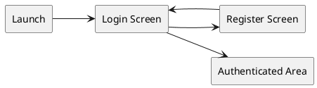
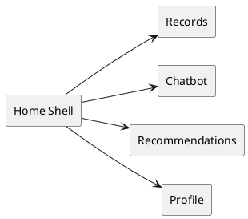

# 05 Android UI Spec

## Spec Metadata

| Field | Value |
| --- | --- |
| Status | Draft baseline |
| Controls | REQ-01, REQ-02, REQ-04 through REQ-07, REQ-10, REQ-13, NFR-02, NFR-04 |
| Primary audience | Android owners, backend owners, demo owner |
| Upstream specs | `02-specify-project-requirements.md`, `06-plan-api-contracts.md` |
| Downstream specs | Android layouts, ViewModels, manual QA checklist |

## UI Technology

- Kotlin Android app.
- XML layouts, not Jetpack Compose.
- Retrofit for backend REST calls.
- API client read/call timeouts must allow slow local Ollama responses for chatbot and recommendation generation.
- ViewModel and LiveData or StateFlow for screen state.
- Secure token storage for JWT.

## Navigation

Before login:

After login:

Use bottom navigation for the authenticated area:

- Records
- Chat
- Recommendations
- Profile

## Screens

### Login Screen

Fields:

- Email
- Password

Actions:

- Login
- Go to register

States:

- Loading while login request is in progress.
- Inline validation for missing email or password.
- Error banner for invalid credentials or network failure.

Success:

- Store JWT securely.
- Navigate to Records screen.

### Register Screen

Fields:

- Display name
- Email
- Password
- Confirm password

Actions:

- Register
- Back to login

Validation:

- Required display name.
- Valid email format.
- Password at least 8 characters.
- Confirm password matches.

Success:

- Show success message.
- Navigate to login screen.

### Records Screen

Content:

- List of wellness records sorted by date descending.
- Empty state when no records exist.
- Pull-to-refresh or refresh action.
- Floating action button or primary button to add record.

Record item displays:

- Record date
- Sleep hours
- Exercise type and minutes
- Mood score
- Short notes preview

Actions:

- Open detail/edit screen.
- Delete record with confirmation.

States:

- Loading list.
- Empty list.
- Error loading records.
- Delete in progress.

### Add/Edit Record Screen

Fields:

- Date picker for record date
- Sleep hours numeric input
- Exercise type text input or simple spinner
- Exercise minutes numeric input
- Mood score selector from 1 to 5
- Notes multiline text

Actions:

- Save
- Cancel/back
- Delete, edit mode only

Validation:

- Date required.
- Sleep hours between 0 and 24.
- Exercise minutes 0 or greater.
- Mood score between 1 and 5.
- Notes optional.

Success:

- Return to Records screen and refresh list.

### Chatbot Screen

Content:

- Scrollable chat history.
- Message input field.
- Send button.
- Source snippets shown below assistant messages when available.

Behavior:

- Send button disabled for blank messages.
- Show typing/loading indicator while waiting for backend.
- Keep the request alive long enough for local Ollama generation, which may take tens of seconds on student laptops.
- Store and display previous messages loaded from backend.
- If AI service or Ollama is unavailable, show a friendly error and keep the typed question available.

Message display:

- User message aligned distinctly from assistant message.
- Assistant answer includes local model name only if it helps the demo.
- Source titles/snippets are collapsed or visually secondary.

### Recommendations Screen

Content:

- Latest recommendations sorted newest first.
- Generate recommendation button.
- Recommendation cards showing title, trend summary, recommendation text, action items, generated date.

States:

- Loading existing recommendations.
- Generating recommendation.
- Generating state should explain that local AI may take up to a minute.
- Empty state before first recommendation.
- Error if agent service is unavailable.

Success:

- New recommendation appears at top of list.

### Profile Screen

Content:

- Display name
- Email
- App version or team name, optional

Actions:

- Logout

Logout behavior:

- Call backend logout endpoint.
- Clear local JWT.
- Navigate to login screen.
- If backend call fails, still allow local logout after confirmation.

## User Experience Rules

- Keep labels plain and understandable.
- Show actionable error messages, not stack traces.
- Preserve form inputs after validation errors.
- Disable duplicate submissions while requests are in progress.
- Keep all authenticated screens resilient to expired JWT by returning to login.

## Android Acceptance Criteria

- App supports the full demo flow from login to logout.
- All backend calls include JWT after login.
- No screen calls MySQL or Python AI service directly.
- Required form validation works before network requests.
- Loading, empty, success, and error states exist for major workflows.
