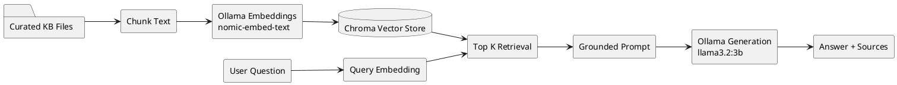

# 06 RAG AI Spec

## Spec Metadata

| Field | Value |
| --- | --- |
| Status | Draft baseline |
| Controls | REQ-10, REQ-11, REQ-12, NFR-03, NFR-05 |
| Primary audience | Python AI owner, backend owner, test owner |
| Upstream specs | `04-plan-system-architecture.md`, `06-plan-api-contracts.md` |
| Downstream specs | Python RAG service, chatbot integration tests |

## Goal

Implement a basic full RAG system for wellness chatbot responses using only local/free tools. The chatbot should retrieve relevant wellness guidance from a curated knowledge base, then ask a local Ollama model to answer using that context.

## Non-Negotiable AI Constraint

No paid LLM APIs and no cloud-only model dependency.

Default local models:

- Generation: `llama3.2:3b`
- Embeddings: `nomic-embed-text`

Default local runtime:

- Ollama

## Knowledge Base

Use a curated wellness knowledge base created by the team during implementation.

Planned location:

```text
rag-knowledge-base/
```

Suggested documents:

- `sleep-hygiene.md`
- `exercise-basics.md`
- `stress-and-mood.md`
- `hydration-and-nutrition.md`
- `healthy-habits-faq.md`

Each document should include:

- Title
- Short source note such as "team-curated educational summary"
- Content written in simple, non-clinical language
- Disclaimer that the app does not provide medical diagnosis

## RAG Pipeline



## Indexing Behavior

- Load Markdown or JSON knowledge files.
- Split content into small chunks of roughly 300 to 600 words.
- Store metadata for each chunk:
  - `title`
  - `source_file`
  - `chunk_index`
  - `snippet`
- Generate embeddings locally through Ollama.
- Use Ollama's current `POST /api/embed` endpoint with `nomic-embed-text` for
  embeddings.
- Persist the Chroma index in a Docker volume.
- Provide a development-only reindex endpoint.

## Retrieval Behavior

- Embed the user question.
- Retrieve top 3 to 5 relevant chunks.
- Include recent wellness record context when Spring Boot provides it.
- If retrieval confidence is low, still answer cautiously and state that the available knowledge base has limited context.

## Prompt Rules

The generation prompt must instruct the model to:

- Answer only wellness education and habit-support questions.
- Use retrieved context first.
- Consider recent wellness records if provided.
- Avoid diagnosis, treatment claims, or emergency advice.
- Encourage professional medical help for serious or urgent symptoms.
- Keep answers concise and practical.
- Return source titles or snippets used.

## Chat Response Contract

Python returns:

- `answer`
- `sources`
- `modelName`

Spring Boot saves:

- User question
- Assistant answer
- Source summary
- Model name
- Timestamp

## Failure Modes

| Failure | Expected Behavior |
| --- | --- |
| Ollama unavailable | Python returns a clear service-unavailable error; Android shows friendly retry message |
| Vector index missing | Python returns setup/reindex-needed error or triggers safe rebuild during development |
| No relevant chunks | Python gives a cautious general response and source list is empty |
| Question outside wellness scope | Python responds that the chatbot only supports wellness habit questions |
| Timeout | Backend returns controlled timeout error to Android |

## RAG Acceptance Criteria

- RAG index can be built from curated KB files.
- Chatbot retrieves relevant chunks before generation.
- Responses include source titles or snippets.
- Ollama is the only LLM runtime used.
- Chat works through Spring Boot, not directly from Android to Python.
