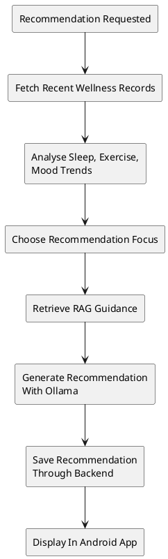

# 07 Agentic AI Spec

## Spec Metadata

| Field | Value |
| --- | --- |
| Status | Draft baseline |
| Controls | REQ-13, NFR-01, NFR-03 |
| Primary audience | Python AI owner, backend owner, Android recommendations owner |
| Upstream specs | `05-plan-backend-data-model-erd.md`, `06-plan-api-contracts.md`, `08-plan-rag-ai-design.md` |
| Downstream specs | Agent implementation, recommendation UI, agent tests |

## Goal

Implement a Python-based agentic AI feature that goes beyond direct chatbot replies. The agent should retrieve a user's recent wellness records, analyse trends, make a simple decision, generate a personalised recommendation using local RAG context, save the recommendation, and display it in the mobile app.

## Trigger

Mandatory trigger:

- User taps "Generate recommendation" in the Android Recommendations screen.

Optional trigger:

- Spring Boot scheduled task runs recommendation generation for active users.

## Agent Workflow

## Detailed Steps

1. Spring Boot receives `POST /api/recommendations/generate` from authenticated Android user.
2. Spring Boot calls Python `POST /agent/recommendation/{userId}`.
3. Python calls Spring Boot internal API to retrieve recent wellness records, default last 14 days.
4. Python analyses trends:
   - Average sleep hours.
   - Number of exercise days.
   - Average exercise minutes.
   - Average mood score.
   - Missing or sparse data.
5. Python chooses one recommendation focus:
   - Sleep consistency.
   - Exercise routine.
   - Mood and stress support.
   - Data consistency when records are sparse.
6. Python retrieves relevant RAG chunks for the chosen focus.
7. Python prompts Ollama to generate a practical recommendation.
   - Keep the RAG context and generated output bounded so CPU-only Ollama
     inference on the DigitalOcean droplet can complete during the demo.
8. Python saves the recommendation through Spring Boot internal API.
9. Spring Boot returns the saved recommendation to Android.

## Decision Rules

Use simple deterministic decision rules before calling the LLM:

- If fewer than 3 wellness records exist, focus on consistent tracking.
- Else if average sleep is below 7 hours, focus on sleep consistency.
- Else if exercise occurs fewer than 3 days in the last 7 days, focus on light activity routine.
- Else if average mood score is 2 or lower, focus on stress and mood support.
- Else focus on maintaining balanced habits.

These rules make the agentic behavior explainable for marking.

## Recommendation Output

The saved recommendation should include:

- Title
- Trend summary
- Recommendation text
- 3 action items
- Generated timestamp
- `generatedBy` value of `python-agent`

## Safety Rules

- Recommendations are wellness habit suggestions, not medical diagnosis.
- Serious symptoms should prompt the user to seek professional medical advice.
- The agent should not claim certainty from sparse data.
- The agent should mention when the user needs more logs for better personalisation.

## Failure Modes

| Failure | Expected Behavior |
| --- | --- |
| No wellness records | Generate a tracking-focused starter recommendation |
| Backend internal API unavailable | Return controlled error to Spring Boot |
| Ollama unavailable | Return controlled AI unavailable error |
| Save fails | Return error and do not pretend recommendation was saved |
| Timeout | Android shows friendly retry message |

## Observability (LangSmith Tracing)

The recommendation workflow is built with LangChain (a
`PromptTemplate | OllamaLLM | StrOutputParser` chain), so its generation step is
traced to LangSmith automatically when tracing is enabled. The shared
`rag.retrieve` step (see `08-plan-rag-ai-design.md`) is instrumented with
`@traceable`, so a generated recommendation produces a single run tree covering
retrieval and generation.

- Tracing is an observability layer only and does not perform inference, so the
  local/free AI constraint holds: with tracing disabled (the default) the agent
  runs fully local/offline on Ollama.
- Configuration is env-driven and off by default (`LANGSMITH_TRACING`,
  `LANGSMITH_API_KEY`, `LANGSMITH_PROJECT`, `LANGSMITH_ENDPOINT`); startup
  no-ops with a warning if enabled without an API key.
- The deterministic decision rules run before the LLM and are not affected by
  tracing, so the workflow stays explainable for marking.
- Deploy wiring for these variables is defined in `10-plan-docker-devops.md`.

## Acceptance Criteria

- Agent retrieves recent records instead of relying only on the user's prompt.
- Agent analyses trends before generation.
- Agent chooses a recommendation focus using deterministic rules.
- Agent uses RAG context and Ollama locally.
- Recommendation is saved in MySQL through Spring Boot.
- Android can display generated recommendations.
- Tracing is disabled by default; when enabled, a generated recommendation
  appears as a LangSmith run tree without changing the saved output.
