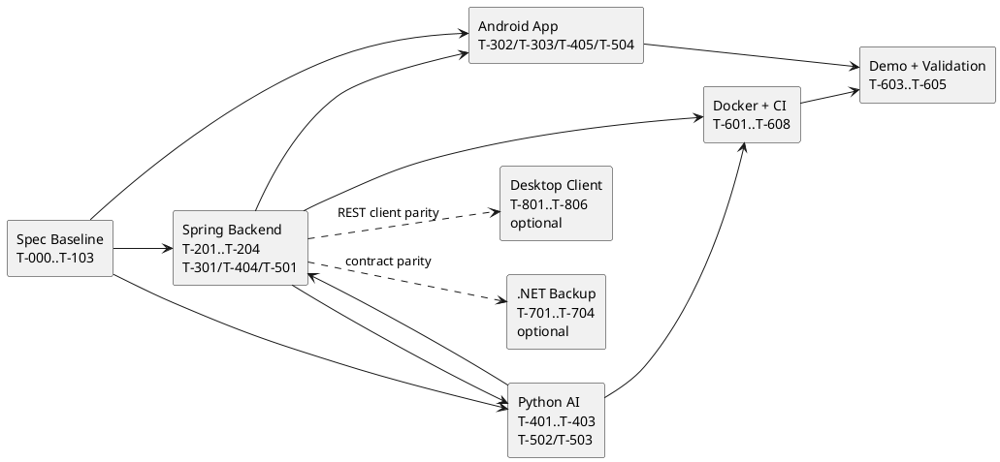

# 13 Implementation Tasks

<!-- @author Abu Bakar Nasir, Tiong Zhong Cheng -->

## Purpose

This file translates the spec plan into implementation-ready task units. It corresponds to the Spec Kit **Tasks** step.

Implementation is now active. Treat the table below as the original traceable
task contract, and use the status snapshot to understand which planned units
already have repository evidence.

## Task Status Values

- Not started
- In progress
- Blocked
- In review
- Done

## Current Implementation Snapshot

This snapshot was reconciled against the repository on 2026-07-07. It is not a
replacement for PR evidence; it tells reviewers which backlog units have concrete
code, tests, or operations files in place.

| Area | Status | Repository Evidence | Remaining Spec-Driven Checks |
| --- | --- | --- | --- |
| Spring backend core | Implemented, verification active | `spring-backend/src/main/java/sg/edu/nus/iss/wellness/` controllers, services, models, repositories, JWT security, Google SSO verifier, streaming chat service, optional premium weather-agent routing | Keep ownership/auth tests green; verify API docs after route changes |
| Android app | Implemented, UI QA active | `DashboardActivity`, `RecordFormActivity`, `ChatActivity`, `RecommendationsActivity`, `ProfileActivity`, XML layouts, `ListView` adapters, streaming chat client with optional coarse-location fields, dashboard helper tests | Manual compact-screen QA against Figma; keep Dashboard as landing screen |
| Python AI service | Implemented, live-model smoke optional | FastAPI routes for health, RAG chat, streaming chat, reindex, recommendation agent; Chroma/Ollama clients; six-file curated KB including BMI/body metrics guidance | Run non-integration pytest in CI; live Ollama smoke before demo |
| Docker/local runtime | Implemented | `docker-compose.yml`, `docker-compose.prod.yml`, `.env.example`, `docker-compose.dotnet-backup.yml`, `docker-compose.sonar.yml` | Clean-machine compose smoke and model pull/reindex check |
| CI/quality/deployment | Implemented, evidence-gated | `.github/workflows/ci.yml`, `deploy.yml`, `infra.yml`, pinned actions, lockfile verification, SonarQube and Ansible jobs, Terraform/Ansible roots | Capture final Actions/SonarQube evidence; deployment remains optional for local demo |
| Optional .NET backup backend | Implemented as bonus/cold standby | `dotnet-backend/` endpoints, services, tests, backup Compose override | Keep parity note explicit: Spring remains canonical for `REQ-08` |
| Optional .NET desktop client | Implemented as bonus client | `desktop-app/` Avalonia app, API client, tests, packaging script | Demo only after mandatory Android flow is reliable |

### Updated Task Flow

## Phase 0: Spec Review

| Task ID | Requirement IDs | Task | Owner | Depends On | Done When |
| --- | --- | --- | --- | --- | --- |
| T-000 | All | Review constitution and spec index with team | Whole team | None | Team accepts docs as implementation contract |
| T-001 | All | Confirm open questions in clarification log | Whole team | T-000 | Open questions have defaults or answers |
| T-002 | All | Confirm final team ownership | Whole team | T-001 | Owners are assigned and recorded |

## Phase 1: Scaffold Later

| Task ID | Requirement IDs | Task | Owner | Depends On | Done When |
| --- | --- | --- | --- | --- | --- |
| T-101 | REQ-08, REQ-14 | Create monorepo implementation structure | Member 7 | Phase 0 | Planned folders exist and builds can start |
| T-102 | REQ-16 | Add GitHub branch rules and PR template | Member 7 | T-101 | PRs require spec/test evidence |
| T-103 | REQ-16 | Add initial GitHub Actions workflows | Member 7 | T-101 | CI runs skeleton checks |

## Phase 2: Backend Foundation

| Task ID | Requirement IDs | Task | Owner | Depends On | Done When |
| --- | --- | --- | --- | --- | --- |
| T-201 | REQ-08, REQ-09 | Scaffold Spring Boot backend | Member 4 | T-101 | Backend health endpoint runs |
| T-202 | REQ-09, REQ-15 | Implement MySQL schema/entities from ERD | Member 5 | T-201 | Schema matches `05-plan-backend-data-model-erd.md` |
| T-203 | REQ-02, REQ-03 | Implement register, login, JWT security | Member 4 | T-201 | Auth tests pass |
| T-204 | NFR-01 | Add ownership security checks | Member 4 | T-203 | Cross-user access tests pass |

## Phase 3: Wellness CRUD

| Task ID | Requirement IDs | Task | Owner | Depends On | Done When |
| --- | --- | --- | --- | --- | --- |
| T-301 | REQ-04, REQ-05, REQ-06, REQ-07 | Implement wellness CRUD APIs | Member 5 | T-202, T-203 | API tests pass |
| T-302 | REQ-01, REQ-02 | Implement Android login/register/logout (realigned to AppCompatActivity + View Binding, T-701) | Member 1 | T-203 | Auth works from app |
| T-303 | REQ-04 through REQ-07 | Implement Android wellness screens (realigned to AppCompatActivity + View Binding + ListView/ArrayAdapter, T-701)| Member 2 | T-301, T-302 | CRUD works end to end |

## Phase 4: RAG Chatbot

| Task ID | Requirement IDs | Task | Owner | Depends On | Done When |
| --- | --- | --- | --- | --- | --- |
| T-401 | REQ-11, REQ-12 | Scaffold Python RAG service | Member 6 | T-101 | AI health endpoint runs |
| T-402 | REQ-11 | Create curated wellness KB | Member 6 | T-401 | KB files load and chunk |
| T-403 | REQ-11, REQ-12 | Implement Chroma indexing and Ollama embedding | Member 6 | T-402 | RAG indexing test passes |
| T-404 | REQ-10, REQ-11, REQ-12 | Implement backend chat orchestration, including optional local premium weather-agent fallback routing | Member 5 | T-301, T-403 | Chat API stores answer and sources; premium route fails soft to standard RAG |
| T-405 | REQ-10 | Implement Android chatbot screen (realigned to AppCompatActivity + View Binding + ListView/ArrayAdapter, T-701) with optional coarse-location fields for backend-mediated premium routing | Member 3 | T-404 | Chat works from app |

## Phase 5: Agentic AI

| Task ID | Requirement IDs | Task | Owner | Depends On | Done When |
| --- | --- | --- | --- | --- | --- |
| T-501 | REQ-13 | Implement backend internal record/recommendation APIs | Member 5 | T-301 | Python can retrieve/save through backend |
| T-502 | REQ-13 | Implement agent deterministic trend rules | Member 7 | T-501 | Agent rule tests pass |
| T-503 | REQ-13 | Implement RAG-assisted recommendation generation | Member 7 | T-403, T-502 | Recommendation saved through backend |
| T-504 | REQ-13 | Implement Android recommendations screen (realigned to AppCompatActivity + View Binding + ListView/ArrayAdapter, T-701)| Member 3 | T-503 | Recommendation visible in app |

## Phase 6: Docker, CI, And Demo

| Task ID | Requirement IDs | Task | Owner | Depends On | Done When |
| --- | --- | --- | --- | --- | --- |
| T-601 | REQ-14 | Create Docker Compose stack | Member 7 | T-201, T-401 | Backend, MySQL, Python, Ollama start |
| T-602 | REQ-16 | Complete GitHub Actions workflows | Member 7 | T-601 | CI passes on PR, and guarded SonarQube Community Build scans publish dashboard evidence for Spring, Android, Python, and the .NET backup backend when `SONAR_HOST_URL` and `SONAR_TOKEN` are configured |
| T-603 | REQ-17, REQ-20 | Prepare repeatable demo seed data and script | Member 7 | T-303, T-405, T-504 | Demo data can be reset/reseeded and rehearsal fits 15 minutes |
| T-604 | REQ-18, REQ-19 | Final submission checklist | Whole team | T-603 | Zip/video/docs ready |
| T-605 | REQ-16, NFR-01, NFR-02, NFR-03 | Add `SECURITY.md` Codex Security scan workflow and collect scan evidence before merge/submission; use SonarQube Community Build as supplementary quality-dashboard evidence | Member 7 | T-602 | PR and final-submission docs state scan type, scope, findings, fixes, accepted suppressions, and SonarQube quality-gate evidence where configured |
| T-606 | REQ-16 | Author Terraform infra (`infra/terraform/`) for the DigitalOcean Droplet, reserved IP, firewall, DNS, and remote state; cloud-init only bootstraps the `deploy` user + Python for Ansible | Member 7 | T-601 | `terraform apply` provisions the Droplet with the `deploy` user reachable by Ansible |
| T-607 | REQ-16 | Add prod overlay (`docker-compose.prod.yml`) and `Caddyfile` for HTTPS + internal-only services | Member 7 | T-601 | Prod overlay validates and exposes only Caddy 80/443 |
| T-608 | REQ-16 | Author Ansible config + deploy playbooks (`infra/ansible/`, bootstrap + app roles), invoke them from `deploy.yml`, add the `ansible` syntax/lint CI job, and configure the `production` Environment and GitHub secrets | Member 7 | T-606, T-607 | Push to `main` runs the playbook; the play is idempotent and the HTTPS health check passes |

## Optional Phase 7: .NET Backup Backend

These tasks are optional backup evidence and do not replace `REQ-08`, which is still satisfied by the Java Spring Boot backend.

| Task ID | Requirement IDs | Task | Owner | Depends On | Done When |
| --- | --- | --- | --- | --- | --- |
| T-701 | REQ-08, REQ-09, REQ-14, NFR-03 | Document `.NET Backup API` cold-standby design in architecture, API, Docker, traceability, and validation specs | Member 7 | T-201, T-601 | Specs state Spring is canonical and .NET is optional backup |
| T-702 | REQ-09, REQ-14, NFR-01 | Scaffold `dotnet-backend/` with status endpoints, config, MySQL schema compatibility, JWT helpers, and author comments | Member 7 | T-701 | `.NET` project builds and health endpoint contract is available |
| T-703 | REQ-02 through REQ-07, REQ-10, REQ-13, NFR-01, NFR-02 | Mirror Spring public and internal API routes in the `.NET Backup API` | Member 7 | T-702, T-301, T-404, T-501 | Backup routes match Spring request/response contracts |
| T-704 | REQ-14, REQ-16, NFR-03, NFR-05 | Add backup Compose override, CI checks, SonarQube scan evidence, and contract smoke checks parameterized by `BASE_URL` | Member 7 | T-702 | Spring path remains unchanged, `.NET` tests run in CI, guarded SonarQube scan publishes the `sa62-wellness-dotnet-backend` project when configured, and backup can be rehearsed on port `8082` |

## Optional Phase 8: .NET Desktop Client

These tasks are optional bonus evidence (`REQ-21`). The desktop client is an additional REST client only; it does not replace Android or any mandatory requirement, and it consumes the same Spring Boot contracts from `06-plan-api-contracts.md`.

| Task ID | Requirement IDs | Task | Owner | Depends On | Done When |
| --- | --- | --- | --- | --- | --- |
| T-801 | REQ-21 | Scaffold `desktop-app/` Avalonia solution, `ApiClient`, `SessionStore`, DTOs, config (`BackendBaseUrl` / `WELLNESS_API_BASE_URL`), and packaged build script support for stamping `BACKEND_BASE_URL` into distributable `appsettings.json` files | Bonus owner | T-203 | Solution builds, `dotnet build` passes, and packaged builds can target the DigitalOcean backend without a launch-time environment variable |
| T-802 | REQ-21, REQ-02, REQ-03, NFR-01, NFR-02 | Implement login/register/logout screens with in-memory JWT storage | Bonus owner | T-801, T-203 | Auth works from desktop against Spring |
| T-803 | REQ-21, REQ-04 through REQ-07, NFR-02, NFR-04 | Implement wellness CRUD screens with loading/empty/success/error states | Bonus owner | T-802, T-301 | CRUD works end to end from desktop |
| T-804 | REQ-21, REQ-10 | Implement chatbot screen with answer and source snippets | Bonus owner | T-803, T-404 | Chat works from desktop |
| T-805 | REQ-21, REQ-13 | Implement recommendations screen (generate and list) | Bonus owner | T-803, T-503 | Recommendation visible in desktop |
| T-806 | REQ-21, REQ-16, NFR-05 | Add `dotnet build`/`dotnet test` CI job and DTO/ApiClient unit tests | Bonus owner | T-801 | Desktop job passes in CI without LLM dependency |

## Optional Phase 9: Privacy Stretch

These tasks are optional stretch evidence (`REQ-23`) mapped to sprint card `S-03`. They should be pulled only after the mandatory Android Profile flow, backend ownership checks, and demo-critical AI flows are stable.

| Task ID | Requirement IDs | Task | Owner | Depends On | Done When |
| --- | --- | --- | --- | --- | --- |
| T-901 | REQ-23, NFR-01, NFR-02 | Implement Spring account export and account deletion endpoints | Member 4 | T-204, T-301, T-404, T-501 | `GET /api/account/export` returns only the current user's profile, records, chats, and recommendations without secrets; `DELETE /api/account` transactionally removes the user's owned rows and user row |
| T-902 | REQ-23, NFR-04 | Implement Android Privacy screen launched from Profile | Member 1 | T-302, T-303, T-901 | Screen explains local AI/data path, export opens a JSON share/save flow, delete requires confirmation, successful delete clears local auth and returns to Login |
| T-903 | REQ-23, NFR-01, NFR-02 | Add privacy/export/delete validation evidence | Members 4 + 1 | T-901, T-902 | Backend tests cover export ownership and post-delete access; Android manual QA covers export, cancel delete, confirmed delete, offline failure, and expired-token handling |

## Optional Phase 10: Security Hardening Stretch

These tasks are optional stretch evidence mapped to sprint card `S-04` and governed by [DEC-016](03-clarify-decisions-and-edge-cases.md). They close the "no login rate-limit/lockout" gap recorded in the `16-kanban-sprint-board.md` self-assessment.

| Task ID | Requirement IDs | Task | Owner | Depends On | Done When |
| --- | --- | --- | --- | --- | --- |
| T-1001 | S-04, REQ-02, NFR-02 | Add per-account login throttling to Spring (`LoginAttemptService`) and mirror it in the `.NET Backup API` | Member 4 | T-205 | More than `max-attempts` consecutive failures lock the account for `lockout-seconds`; `/api/auth/login` and `/api/auth/reactivate` answer `429` with `Retry-After` before any credential check; a successful password login, reactivation, or Google sign-in clears the counter |
| T-1002 | S-04, REQ-02, NFR-04 | Surface throttling and token expiry in the Android login UX | Member 1 | T-1001, T-302 | A `429` shows a lockout banner built from the `Retry-After` window; an expired token returns to Login with a "session expired" banner and a cleared back stack |
| T-1003 | S-04, REQ-16 | Keep clear-text HTTP out of non-demo builds | Member 1 | T-1002 | A `release` build type exists and applies `network_security_config.xml`, whose base config forbids clear text; the exception list stays limited to the documented local development hosts |
| T-1004 | S-04, NFR-02 | Add throttling validation evidence | Members 4 + 1 | T-1001, T-1002 | Backend tests cover lock-after-threshold, `429`-before-credential-check, window expiry, and success-clears-counter; `LoginLockoutTest` covers the Android message formatting; manual QA covers the lockout and session-expired banners |

## Implementation Rule

Every future implementation PR should list:

- Task IDs.
- Requirement IDs.
- Spec files changed.
- Tests or demo checks run.
